# CSIRO Low-Carb Diet App - Architecture Documentation

**Version:** 1.0
**Last Updated:** January 2026
**Status:** Design Phase

---

## Table of Contents

1. [System Overview](#system-overview)
2. [Component Architecture](#component-architecture)
3. [Data Flow Diagrams](#data-flow-diagrams)
4. [Database Architecture](#database-architecture)
5. [API Architecture](#api-architecture)
6. [Authentication Architecture](#authentication-architecture)
7. [File Storage Architecture](#file-storage-architecture)
8. [Mobile App Architecture](#mobile-app-architecture)
9. [Deployment Architecture](#deployment-architecture)
10. [Migration Path](#migration-path)

---

## System Overview

### High-Level Architecture

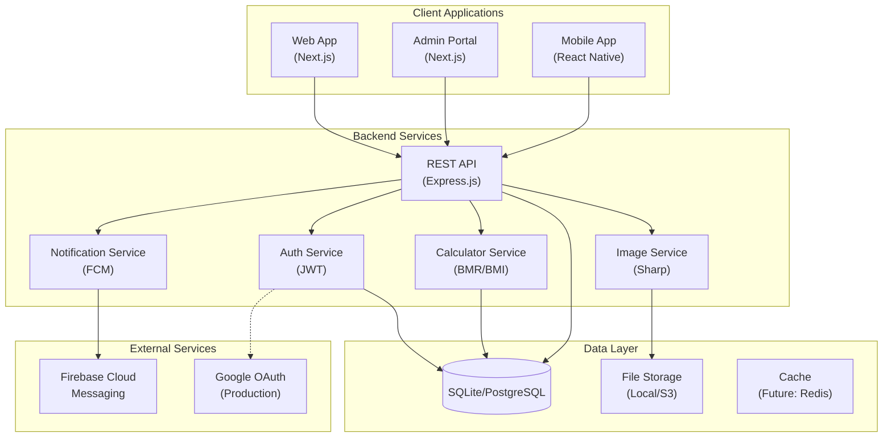
```mermaid
flowchart TB
    subgraph Clients["Client Applications"]
        WEB["Web App<br/>(Next.js)"]
        ADMIN["Admin Portal<br/>(Next.js)"]
        MOBILE["Mobile App<br/>(React Native)"]
    end

    subgraph Backend["Backend Services"]
        API["REST API<br/>(Express.js)"]
        AUTH["Auth Service<br/>(JWT)"]
        CALC["Calculator Service<br/>(BMR/BMI)"]
        IMG["Image Service<br/>(Sharp)"]
        NOTIF["Notification Service<br/>(FCM)"]
    end

    subgraph Data["Data Layer"]
        DB[(SQLite/PostgreSQL)]
        FILES["File Storage<br/>(Local/S3)"]
        CACHE["Cache<br/>(Future: Redis)"]
    end

    subgraph External["External Services"]
        FCM["Firebase Cloud<br/>Messaging"]
        OAUTH["Google OAuth<br/>(Production)"]
    end

    WEB --> API
    ADMIN --> API
    MOBILE --> API

    API --> AUTH
    API --> CALC
    API --> IMG
    API --> NOTIF

    AUTH --> DB
    CALC --> DB
    IMG --> FILES
    NOTIF --> FCM

    API --> DB
    AUTH -.-> OAUTH
```

### Architecture Principles

| Principle | Description |
|-----------|-------------|
| **Local-First** | Start with SQLite and local file storage, migrate to cloud when needed |
| **Backend-First** | Build and test API before frontend development |
| **CSIRO-Specific** | Diet levels, food units, and calculations based on CSIRO guidelines |
| **Privacy by Design** | User owns all data with export and deletion capabilities |
| **Separation of Concerns** | Distinct apps for users, admin, and mobile |

---

## Component Architecture

### Backend Components


```mermaid
flowchart LR
    subgraph Routes["Routes Layer"]
        AR["/auth"]
        PR["/profile"]
        TR["/tracking"]
        FR["/foods"]
        MR["/meals"]
        RR["/recipes"]
        ADR["/admin/*"]
        MBR["/mobile/*"]
    end

    subgraph Middleware["Middleware Layer"]
        AUTH_MW["Auth Middleware"]
        ADMIN_MW["Admin Middleware"]
        VAL_MW["Validation Middleware"]
        RATE_MW["Rate Limiter"]
    end

    subgraph Services["Service Layer"]
        AUTH_SVC["Auth Service"]
        CALC_SVC["Calculator Service"]
        FOOD_SVC["Food Service"]
        MEAL_SVC["Meal Service"]
        RECIPE_SVC["Recipe Service"]
        IMG_SVC["Image Service"]
        NOTIF_SVC["Notification Service"]
    end

    subgraph Data["Data Access Layer"]
        USER_REPO["User Repository"]
        FOOD_REPO["Food Repository"]
        MEAL_REPO["Meal Repository"]
        RECIPE_REPO["Recipe Repository"]
    end

    Routes --> Middleware
    Middleware --> Services
    Services --> Data
```

### Frontend Components (User App)

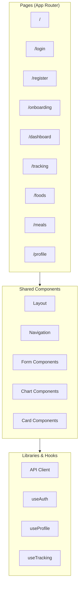
```mermaid
flowchart TB
    subgraph Pages["Pages (App Router)"]
        HOME["/"]
        LOGIN["/login"]
        REGISTER["/register"]
        ONBOARD["/onboarding"]
        DASH["/dashboard"]
        TRACK["/tracking"]
        FOODS["/foods"]
        MEALS["/meals"]
        PROFILE["/profile"]
    end

    subgraph Components["Shared Components"]
        LAYOUT["Layout"]
        NAV["Navigation"]
        FORMS["Form Components"]
        CHARTS["Chart Components"]
        CARDS["Card Components"]
    end

    subgraph Lib["Libraries & Hooks"]
        API_CLIENT["API Client"]
        AUTH_HOOK["useAuth"]
        PROFILE_HOOK["useProfile"]
        TRACKING_HOOK["useTracking"]
    end

    Pages --> Components
    Components --> Lib
```

### Admin Portal Components

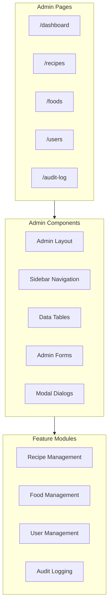
```mermaid
flowchart TB
    subgraph AdminPages["Admin Pages"]
        A_DASH["/dashboard"]
        A_RECIPES["/recipes"]
        A_FOODS["/foods"]
        A_USERS["/users"]
        A_AUDIT["/audit-log"]
    end

    subgraph AdminComponents["Admin Components"]
        A_LAYOUT["Admin Layout"]
        A_SIDEBAR["Sidebar Navigation"]
        A_TABLES["Data Tables"]
        A_FORMS["Admin Forms"]
        A_MODALS["Modal Dialogs"]
    end

    subgraph AdminFeatures["Feature Modules"]
        RECIPE_MGMT["Recipe Management"]
        FOOD_MGMT["Food Management"]
        USER_MGMT["User Management"]
        AUDIT["Audit Logging"]
    end

    AdminPages --> AdminComponents
    AdminComponents --> AdminFeatures
```

---

## Data Flow Diagrams

### User Registration & Onboarding Flow (Google OAuth)

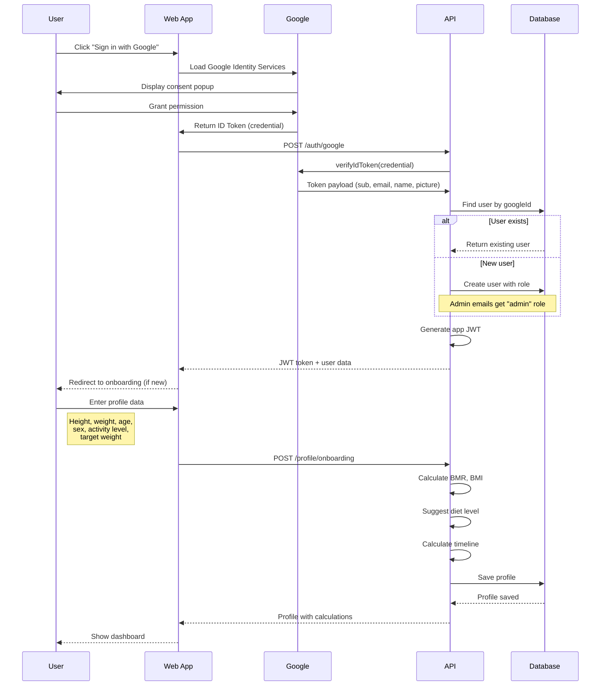
```mermaid
sequenceDiagram
    participant U as User
    participant W as Web App
    participant G as Google
    participant A as API
    participant DB as Database

    U->>W: Click "Sign in with Google"
    W->>G: Load Google Identity Services
    G->>U: Display consent popup
    U->>G: Grant permission
    G->>W: Return ID Token (credential)
    W->>A: POST /auth/google
    A->>G: verifyIdToken(credential)
    G->>A: Token payload (sub, email, name, picture)
    A->>DB: Find user by googleId
    alt User exists
        DB-->>A: Return existing user
    else New user
        A->>DB: Create user with role
        Note over A,DB: Admin emails get "admin" role
    end
    A->>A: Generate app JWT
    A-->>W: JWT token + user data
    W-->>U: Redirect to onboarding (if new)

    U->>W: Enter profile data
    Note right of U: Height, weight, age,<br/>sex, activity level,<br/>target weight
    W->>A: POST /profile/onboarding
    A->>A: Calculate BMR, BMI
    A->>A: Suggest diet level
    A->>A: Calculate timeline
    A->>DB: Save profile
    DB-->>A: Profile saved
    A-->>W: Profile with calculations
    W-->>U: Show dashboard
```

### Daily Weight Logging Flow

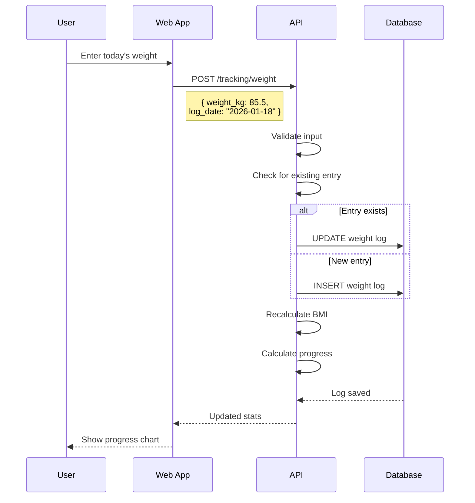
```mermaid
sequenceDiagram
    participant U as User
    participant W as Web App
    participant A as API
    participant DB as Database

    U->>W: Enter today's weight
    W->>A: POST /tracking/weight
    Note right of W: { weight_kg: 85.5,<br/>log_date: "2026-01-18" }
    A->>A: Validate input
    A->>A: Check for existing entry
    alt Entry exists
        A->>DB: UPDATE weight log
    else New entry
        A->>DB: INSERT weight log
    end
    A->>A: Recalculate BMI
    A->>A: Calculate progress
    DB-->>A: Log saved
    A-->>W: Updated stats
    W-->>U: Show progress chart
```

### Food Search & Alternatives Flow

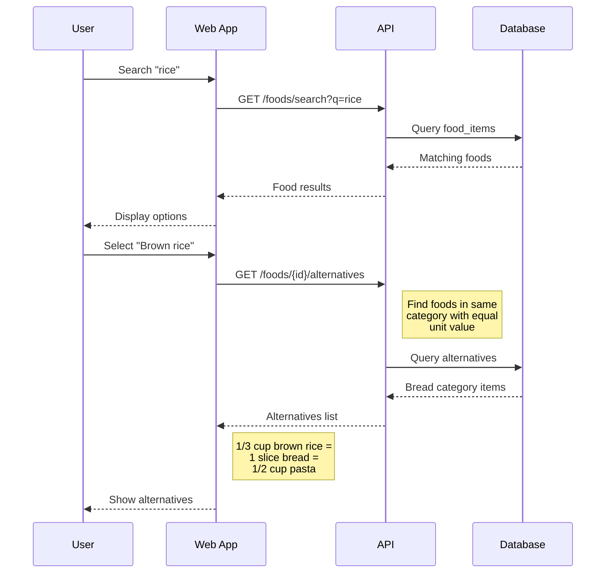
```mermaid
sequenceDiagram
    participant U as User
    participant W as Web App
    participant A as API
    participant DB as Database

    U->>W: Search "rice"
    W->>A: GET /foods/search?q=rice
    A->>DB: Query food_items
    DB-->>A: Matching foods
    A-->>W: Food results
    W-->>U: Display options

    U->>W: Select "Brown rice"
    W->>A: GET /foods/{id}/alternatives
    Note right of A: Find foods in same<br/>category with equal<br/>unit value
    A->>DB: Query alternatives
    DB-->>A: Bread category items
    A-->>W: Alternatives list
    Note right of W: 1/3 cup brown rice =<br/>1 slice bread =<br/>1/2 cup pasta
    W-->>U: Show alternatives
```

### Meal Logging with Images Flow

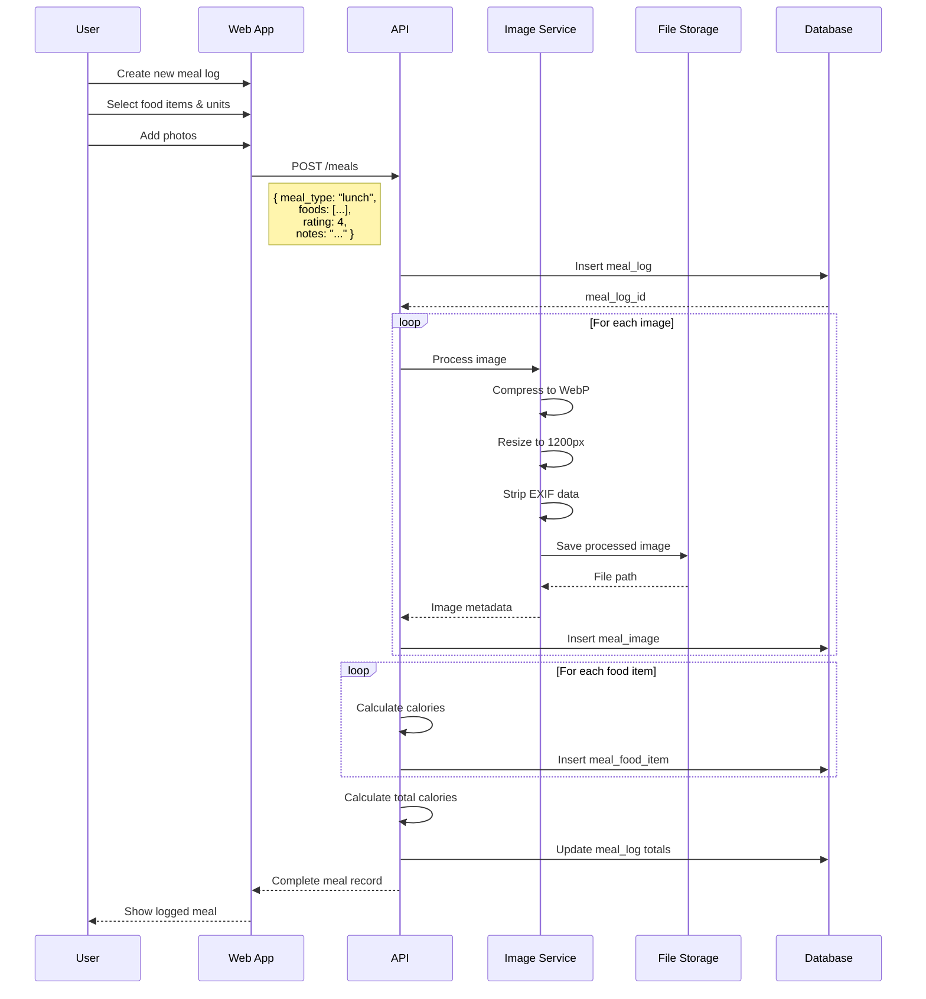
```mermaid
sequenceDiagram
    participant U as User
    participant W as Web App
    participant A as API
    participant IMG as Image Service
    participant FS as File Storage
    participant DB as Database

    U->>W: Create new meal log
    U->>W: Select food items & units
    U->>W: Add photos
    W->>A: POST /meals
    Note right of W: { meal_type: "lunch",<br/>foods: [...],<br/>rating: 4,<br/>notes: "..." }

    A->>DB: Insert meal_log
    DB-->>A: meal_log_id

    loop For each image
        A->>IMG: Process image
        IMG->>IMG: Compress to WebP
        IMG->>IMG: Resize to 1200px
        IMG->>IMG: Strip EXIF data
        IMG->>FS: Save processed image
        FS-->>IMG: File path
        IMG-->>A: Image metadata
        A->>DB: Insert meal_image
    end

    loop For each food item
        A->>A: Calculate calories
        A->>DB: Insert meal_food_item
    end

    A->>A: Calculate total calories
    A->>DB: Update meal_log totals
    A-->>W: Complete meal record
    W-->>U: Show logged meal
```

### Admin Recipe Creation Flow

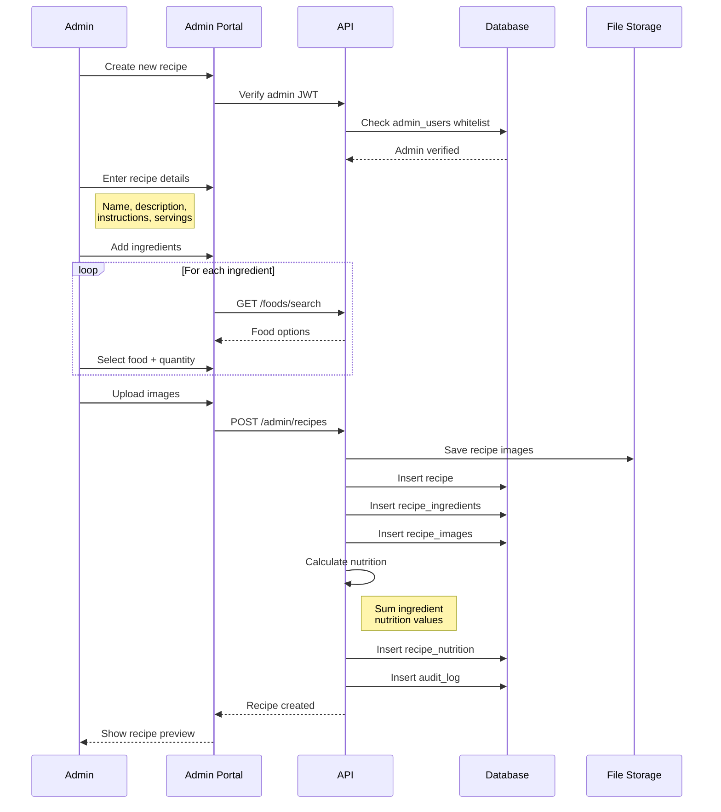
```mermaid
sequenceDiagram
    participant AD as Admin
    participant AP as Admin Portal
    participant A as API
    participant DB as Database
    participant FS as File Storage

    AD->>AP: Create new recipe
    AP->>A: Verify admin JWT
    A->>DB: Check admin_users whitelist
    DB-->>A: Admin verified

    AD->>AP: Enter recipe details
    Note right of AD: Name, description,<br/>instructions, servings

    AD->>AP: Add ingredients
    loop For each ingredient
        AP->>A: GET /foods/search
        A-->>AP: Food options
        AD->>AP: Select food + quantity
    end

    AD->>AP: Upload images
    AP->>A: POST /admin/recipes
    A->>FS: Save recipe images
    A->>DB: Insert recipe
    A->>DB: Insert recipe_ingredients
    A->>DB: Insert recipe_images

    A->>A: Calculate nutrition
    Note right of A: Sum ingredient<br/>nutrition values
    A->>DB: Insert recipe_nutrition

    A->>DB: Insert audit_log
    A-->>AP: Recipe created
    AP-->>AD: Show recipe preview
```

### Push Notification Flow (Mobile)

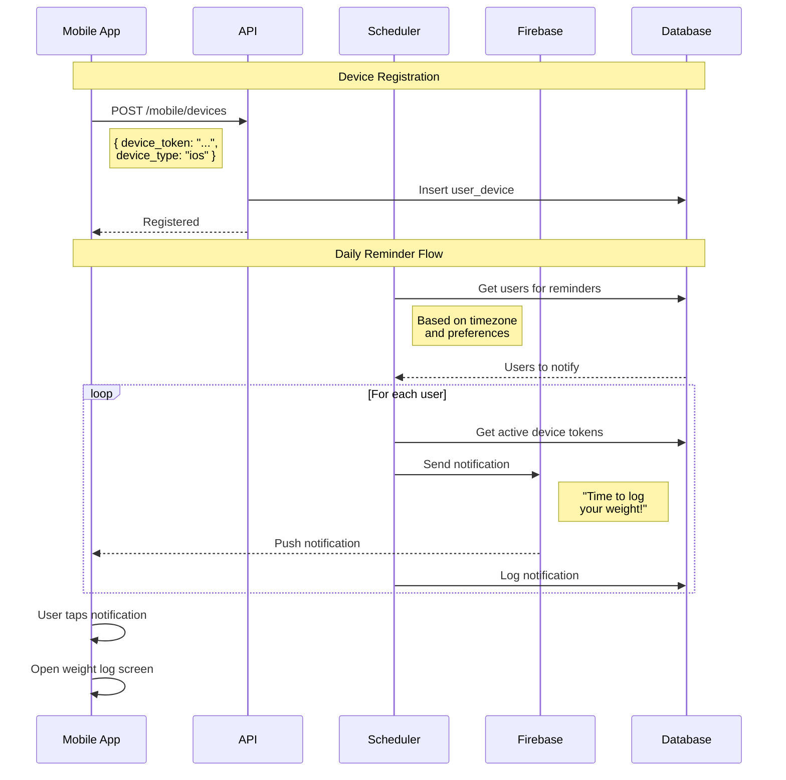
```mermaid
sequenceDiagram
    participant M as Mobile App
    participant A as API
    participant S as Scheduler
    participant FCM as Firebase
    participant DB as Database

    Note over M,DB: Device Registration
    M->>A: POST /mobile/devices
    Note right of M: { device_token: "...",<br/>device_type: "ios" }
    A->>DB: Insert user_device
    A-->>M: Registered

    Note over M,DB: Daily Reminder Flow
    S->>DB: Get users for reminders
    Note right of S: Based on timezone<br/>and preferences
    DB-->>S: Users to notify

    loop For each user
        S->>DB: Get active device tokens
        S->>FCM: Send notification
        Note right of FCM: "Time to log<br/>your weight!"
        FCM-->>M: Push notification
        S->>DB: Log notification
    end

    M->>M: User taps notification
    M->>M: Open weight log screen
```

---

## Database Architecture

### Entity Relationship Diagram

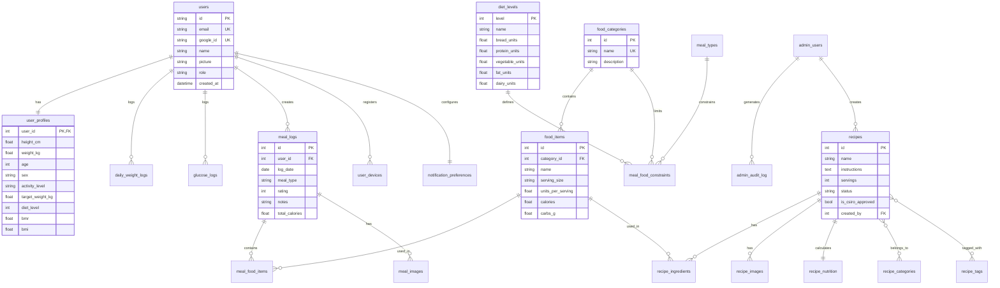
```mermaid
erDiagram
    users ||--|| user_profiles : has
    users ||--o{ daily_weight_logs : logs
    users ||--o{ glucose_logs : logs
    users ||--o{ meal_logs : creates
    users ||--o{ user_devices : registers
    users ||--|| notification_preferences : configures

    meal_logs ||--o{ meal_food_items : contains
    meal_logs ||--o{ meal_images : has

    food_categories ||--o{ food_items : contains
    food_items ||--o{ meal_food_items : used_in
    food_items ||--o{ recipe_ingredients : used_in

    diet_levels ||--o{ meal_food_constraints : defines
    meal_types ||--o{ meal_food_constraints : constrains
    food_categories ||--o{ meal_food_constraints : limits

    recipes ||--o{ recipe_ingredients : has
    recipes ||--o{ recipe_images : has
    recipes ||--|| recipe_nutrition : calculates
    recipes }o--o{ recipe_categories : belongs_to
    recipes }o--o{ recipe_tags : tagged_with

    admin_users ||--o{ admin_audit_log : generates
    admin_users ||--o{ recipes : creates

    users {
        string id PK
        string email UK
        string google_id UK
        string name
        string picture
        string role
        datetime created_at
    }

    user_profiles {
        int user_id PK,FK
        float height_cm
        float weight_kg
        int age
        string sex
        string activity_level
        float target_weight_kg
        int diet_level
        float bmr
        float bmi
    }

    food_categories {
        int id PK
        string name UK
        string description
    }

    food_items {
        int id PK
        int category_id FK
        string name
        string serving_size
        float units_per_serving
        float calories
        float carbs_g
    }

    diet_levels {
        int level PK
        string name
        float bread_units
        float protein_units
        float vegetable_units
        float fat_units
        float dairy_units
    }

    meal_logs {
        int id PK
        int user_id FK
        date log_date
        string meal_type
        int rating
        string notes
        float total_calories
    }

    recipes {
        int id PK
        string name
        text instructions
        int servings
        string status
        bool is_csiro_approved
        int created_by FK
    }
```

### Table Relationships Summary

| Parent Table | Child Table | Relationship | Cascade |
|--------------|-------------|--------------|---------|
| users | user_profiles | 1:1 | DELETE |
| users | daily_weight_logs | 1:N | DELETE |
| users | glucose_logs | 1:N | DELETE |
| users | meal_logs | 1:N | DELETE |
| users | user_devices | 1:N | DELETE |
| meal_logs | meal_food_items | 1:N | DELETE |
| meal_logs | meal_images | 1:N | DELETE |
| food_categories | food_items | 1:N | RESTRICT |
| recipes | recipe_ingredients | 1:N | DELETE |
| admin_users | admin_audit_log | 1:N | RESTRICT |

---

## API Architecture

### API Endpoint Map

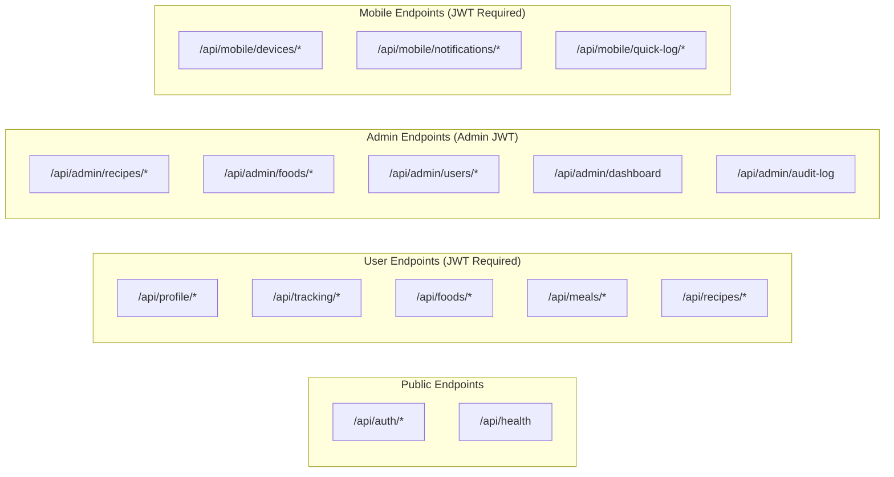
```mermaid
flowchart LR
    subgraph Public["Public Endpoints"]
        AUTH["/api/auth/*"]
        HEALTH["/api/health"]
    end

    subgraph User["User Endpoints (JWT Required)"]
        PROFILE["/api/profile/*"]
        TRACKING["/api/tracking/*"]
        FOODS["/api/foods/*"]
        MEALS["/api/meals/*"]
        RECIPES_PUB["/api/recipes/*"]
    end

    subgraph Admin["Admin Endpoints (Admin JWT)"]
        ADM_RECIPES["/api/admin/recipes/*"]
        ADM_FOODS["/api/admin/foods/*"]
        ADM_USERS["/api/admin/users/*"]
        ADM_DASH["/api/admin/dashboard"]
        ADM_AUDIT["/api/admin/audit-log"]
    end

    subgraph Mobile["Mobile Endpoints (JWT Required)"]
        DEVICES["/api/mobile/devices/*"]
        NOTIF["/api/mobile/notifications/*"]
        QUICK["/api/mobile/quick-log/*"]
    end
```

### API Endpoint Reference

#### Authentication (`/api/auth`)

| Method | Endpoint | Description |
|--------|----------|-------------|
| POST | `/google` | Authenticate with Google ID token |
| GET | `/me` | Get current authenticated user |

#### Profile (`/api/profile`)

| Method | Endpoint | Description |
|--------|----------|-------------|
| GET | `/` | Get current user profile |
| POST | `/onboarding` | Complete initial profile setup |
| PATCH | `/` | Update profile fields |
| GET | `/calculations` | Get BMR, BMI, timeline |

#### Tracking (`/api/tracking`)

| Method | Endpoint | Description |
|--------|----------|-------------|
| POST | `/weight` | Log daily weight |
| GET | `/weight` | Get weight history |
| GET | `/weight/latest` | Get most recent weight |
| POST | `/glucose` | Log glucose reading |
| GET | `/glucose` | Get glucose history |
| GET | `/daily-summary/:date` | Get all logs for a date |

#### Foods (`/api/foods`)

| Method | Endpoint | Description |
|--------|----------|-------------|
| GET | `/search` | Search foods by name |
| GET | `/categories` | List all food categories |
| GET | `/category/:id` | Get foods in category |
| GET | `/:id` | Get food details |
| GET | `/:id/alternatives` | Get unit-equivalent alternatives |
| GET | `/meal-options` | Search by diet level + meal type |

#### Meals (`/api/meals`)

| Method | Endpoint | Description |
|--------|----------|-------------|
| POST | `/` | Create meal log |
| GET | `/` | List user's meals (paginated) |
| GET | `/:id` | Get meal details with images |
| PATCH | `/:id` | Update meal (rating, notes) |
| DELETE | `/:id` | Delete meal and images |
| GET | `/similar` | Find similar past meals |

#### Admin Recipes (`/api/admin/recipes`)

| Method | Endpoint | Description |
|--------|----------|-------------|
| POST | `/` | Create new recipe |
| GET | `/` | List all recipes (with filters) |
| GET | `/:id` | Get recipe details |
| PATCH | `/:id` | Update recipe |
| DELETE | `/:id` | Delete recipe |
| POST | `/:id/publish` | Change status to published |
| POST | `/:id/images` | Upload recipe image |

---

## Authentication Architecture

### Google OAuth + JWT Token Flow

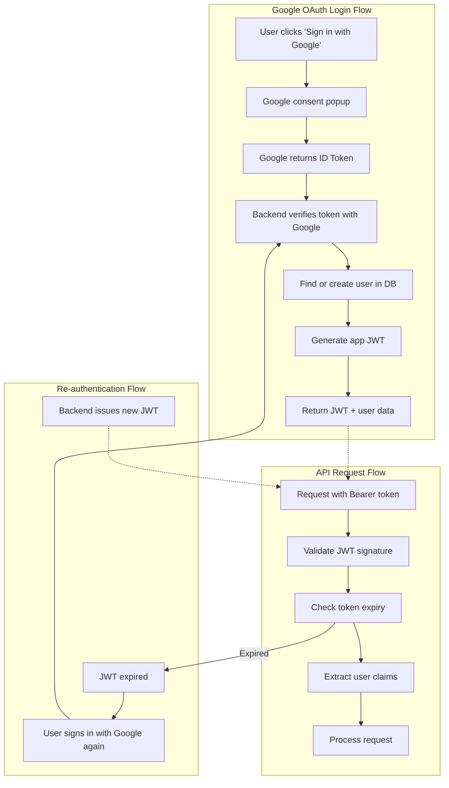
```mermaid
flowchart TB
    subgraph GoogleLogin["Google OAuth Login Flow"]
        G1[User clicks 'Sign in with Google']
        G2[Google consent popup]
        G3[Google returns ID Token]
        G4[Backend verifies token with Google]
        G5[Find or create user in DB]
        G6[Generate app JWT]
        G7[Return JWT + user data]
    end

    subgraph Request["API Request Flow"]
        R1[Request with Bearer token]
        R2[Validate JWT signature]
        R3[Check token expiry]
        R4[Extract user claims]
        R5[Process request]
    end

    subgraph Reauth["Re-authentication Flow"]
        RA1[JWT expired]
        RA2[User signs in with Google again]
        RA3[Backend issues new JWT]
    end

    G1 --> G2 --> G3 --> G4 --> G5 --> G6 --> G7
    R1 --> R2 --> R3 --> R4 --> R5

    G7 -.-> R1
    R3 -->|Expired| RA1
    RA1 --> RA2 --> G4
    RA3 -.-> R1
```

### Token Structure

```
┌─────────────────────────────────────────────────────────────┐
│                        ACCESS TOKEN                          │
├─────────────────────────────────────────────────────────────┤
│  Header                                                      │
│  {                                                           │
│    "alg": "HS256",                                          │
│    "typ": "JWT"                                             │
│  }                                                           │
├─────────────────────────────────────────────────────────────┤
│  Payload                                                     │
│  {                                                           │
│    "sub": "user_123",          // User ID                   │
│    "email": "user@example.com",                             │
│    "role": "user",             // user | admin              │
│    "iat": 1704067200,          // Issued at                 │
│    "exp": 1704153600           // Expires in 24h            │
│  }                                                           │
├─────────────────────────────────────────────────────────────┤
│  Signature                                                   │
│  HMACSHA256(base64(header) + "." + base64(payload), secret) │
└─────────────────────────────────────────────────────────────┘
```

### Admin Authentication Layer

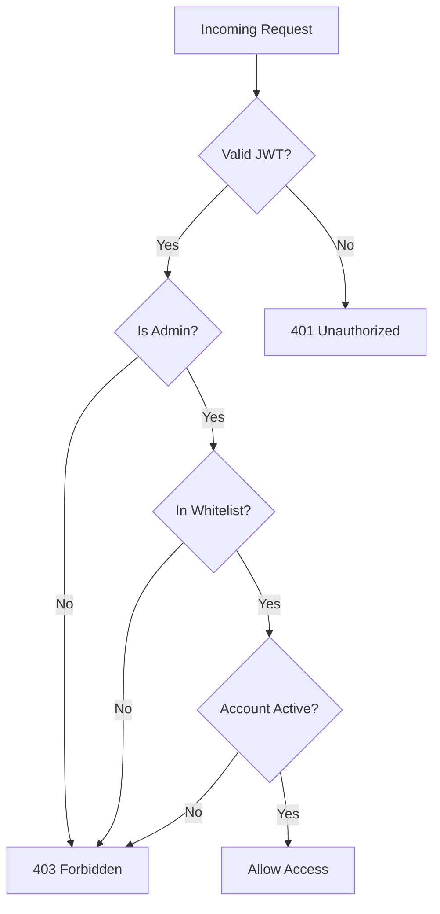
```mermaid
flowchart TB
    REQ[Incoming Request]
    JWT_CHECK{Valid JWT?}
    ADMIN_CHECK{Is Admin?}
    WHITELIST{In Whitelist?}
    ACTIVE{Account Active?}
    ALLOW[Allow Access]
    DENY_401[401 Unauthorized]
    DENY_403[403 Forbidden]

    REQ --> JWT_CHECK
    JWT_CHECK -->|No| DENY_401
    JWT_CHECK -->|Yes| ADMIN_CHECK
    ADMIN_CHECK -->|No| DENY_403
    ADMIN_CHECK -->|Yes| WHITELIST
    WHITELIST -->|No| DENY_403
    WHITELIST -->|Yes| ACTIVE
    ACTIVE -->|No| DENY_403
    ACTIVE -->|Yes| ALLOW
```

---

## File Storage Architecture

### Local Storage Structure

```
backend/
└── uploads/
    └── users/
        └── {userId}/
            └── meals/
                ├── 1704067200-breakfast-001.webp
                ├── 1704067200-breakfast-002.webp
                └── 1704153600-lunch-001.webp
    └── recipes/
        └── {recipeId}/
            ├── primary.webp
            └── gallery-001.webp
```

### Image Processing Pipeline

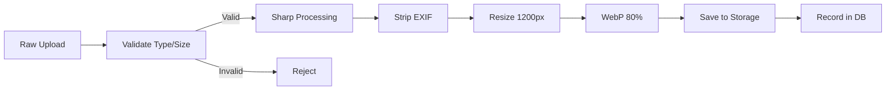
```mermaid
flowchart LR
    UPLOAD[Raw Upload]
    VALIDATE[Validate Type/Size]
    PROCESS[Sharp Processing]
    STRIP[Strip EXIF]
    RESIZE[Resize 1200px]
    COMPRESS[WebP 80%]
    SAVE[Save to Storage]
    RECORD[Record in DB]

    UPLOAD --> VALIDATE
    VALIDATE -->|Invalid| ERROR[Reject]
    VALIDATE -->|Valid| PROCESS
    PROCESS --> STRIP --> RESIZE --> COMPRESS --> SAVE --> RECORD
```

### S3 Migration Structure (Production)

```
csiro-diet-images/
├── users/
│   └── {userId}/
│       └── meals/
│           └── {year}/
│               └── {month}/
│                   └── {timestamp}-{type}-{uuid}.webp
├── recipes/
│   └── {recipeId}/
│       └── {uuid}.webp
└── exports/
    └── {userId}/
        └── {export-id}.zip
```

---

## Mobile App Architecture

### Screen Flow

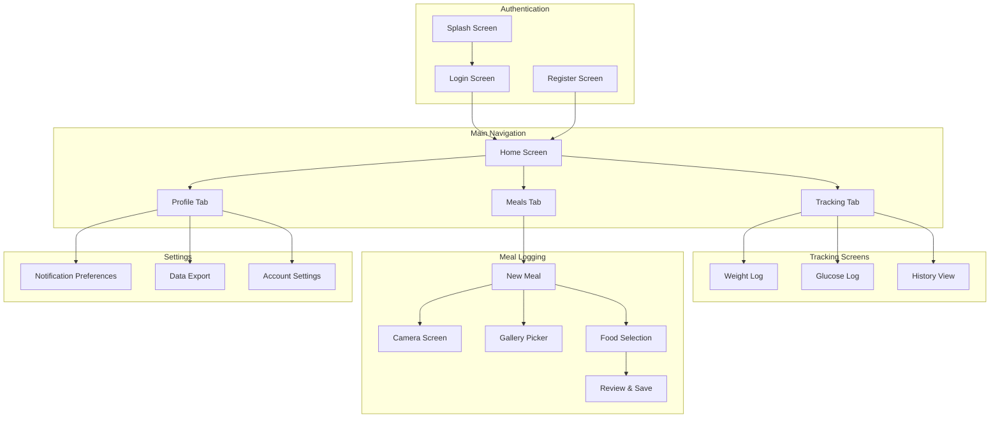
```mermaid
flowchart TB
    subgraph Auth["Authentication"]
        SPLASH[Splash Screen]
        LOGIN[Login Screen]
        REGISTER[Register Screen]
    end

    subgraph Main["Main Navigation"]
        HOME[Home Screen]
        TRACK[Tracking Tab]
        MEALS[Meals Tab]
        PROFILE[Profile Tab]
    end

    subgraph Tracking["Tracking Screens"]
        WEIGHT[Weight Log]
        GLUCOSE[Glucose Log]
        HISTORY[History View]
    end

    subgraph MealFlow["Meal Logging"]
        MEAL_NEW[New Meal]
        CAMERA[Camera Screen]
        GALLERY[Gallery Picker]
        FOOD_SELECT[Food Selection]
        MEAL_REVIEW[Review & Save]
    end

    subgraph Settings["Settings"]
        NOTIF_PREFS[Notification Preferences]
        DATA_EXPORT[Data Export]
        ACCOUNT[Account Settings]
    end

    SPLASH --> LOGIN
    LOGIN --> HOME
    REGISTER --> HOME

    HOME --> TRACK
    HOME --> MEALS
    HOME --> PROFILE

    TRACK --> WEIGHT
    TRACK --> GLUCOSE
    TRACK --> HISTORY

    MEALS --> MEAL_NEW
    MEAL_NEW --> CAMERA
    MEAL_NEW --> GALLERY
    MEAL_NEW --> FOOD_SELECT
    FOOD_SELECT --> MEAL_REVIEW

    PROFILE --> NOTIF_PREFS
    PROFILE --> DATA_EXPORT
    PROFILE --> ACCOUNT
```

### Mobile Data Flow

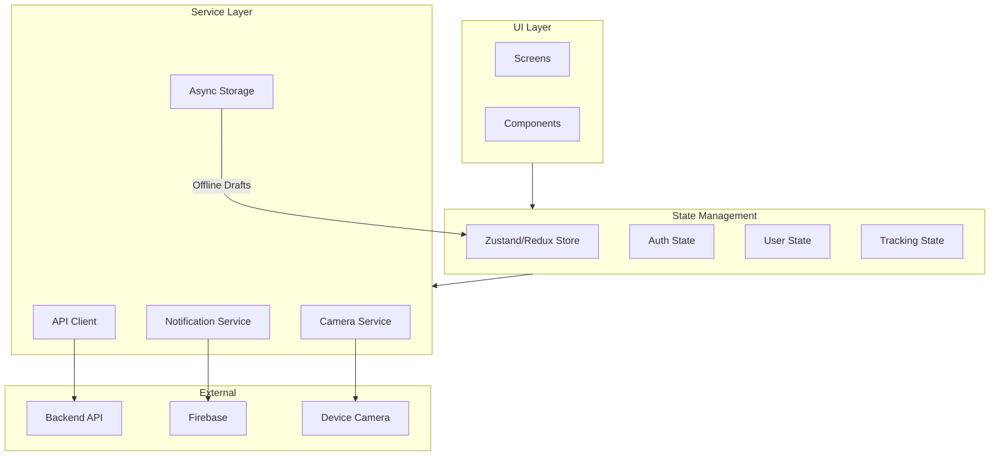
```mermaid
flowchart TB
    subgraph UI["UI Layer"]
        SCREENS[Screens]
        COMPONENTS[Components]
    end

    subgraph State["State Management"]
        STORE[Zustand/Redux Store]
        AUTH_STATE[Auth State]
        USER_STATE[User State]
        TRACKING_STATE[Tracking State]
    end

    subgraph Services["Service Layer"]
        API[API Client]
        STORAGE[Async Storage]
        CAMERA_SVC[Camera Service]
        NOTIF_SVC[Notification Service]
    end

    subgraph External["External"]
        BACKEND[Backend API]
        FCM[Firebase]
        DEVICE_CAM[Device Camera]
    end

    UI --> State
    State --> Services

    API --> BACKEND
    NOTIF_SVC --> FCM
    CAMERA_SVC --> DEVICE_CAM
    STORAGE --> |Offline Drafts| STORE
```

### Offline Support Architecture

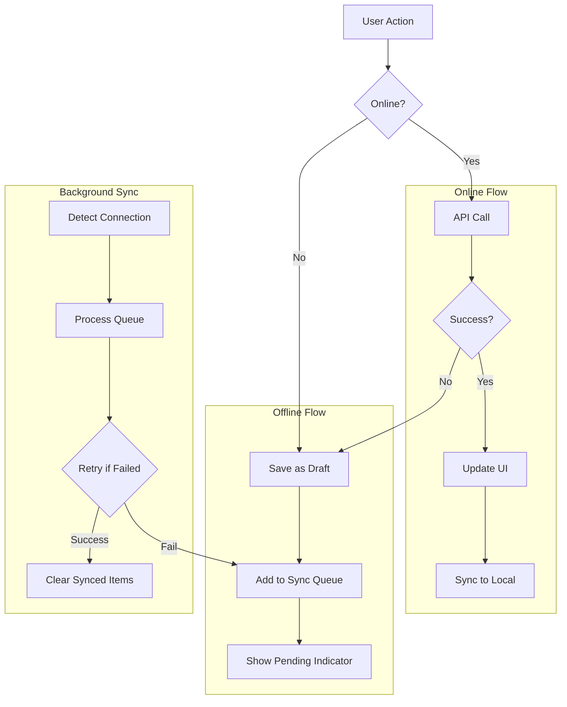
```mermaid
flowchart TB
    USER[User Action]
    ONLINE{Online?}

    subgraph OnlineFlow["Online Flow"]
        API_CALL[API Call]
        SUCCESS{Success?}
        UPDATE_UI[Update UI]
        SYNC_LOCAL[Sync to Local]
    end

    subgraph OfflineFlow["Offline Flow"]
        SAVE_DRAFT[Save as Draft]
        QUEUE[Add to Sync Queue]
        SHOW_PENDING[Show Pending Indicator]
    end

    subgraph SyncProcess["Background Sync"]
        DETECT[Detect Connection]
        PROCESS_QUEUE[Process Queue]
        RETRY{Retry if Failed}
        CLEAR[Clear Synced Items]
    end

    USER --> ONLINE
    ONLINE -->|Yes| API_CALL
    ONLINE -->|No| SAVE_DRAFT

    API_CALL --> SUCCESS
    SUCCESS -->|Yes| UPDATE_UI --> SYNC_LOCAL
    SUCCESS -->|No| SAVE_DRAFT

    SAVE_DRAFT --> QUEUE --> SHOW_PENDING

    DETECT --> PROCESS_QUEUE --> RETRY
    RETRY -->|Success| CLEAR
    RETRY -->|Fail| QUEUE
```

---

## Deployment Architecture

### Local Development

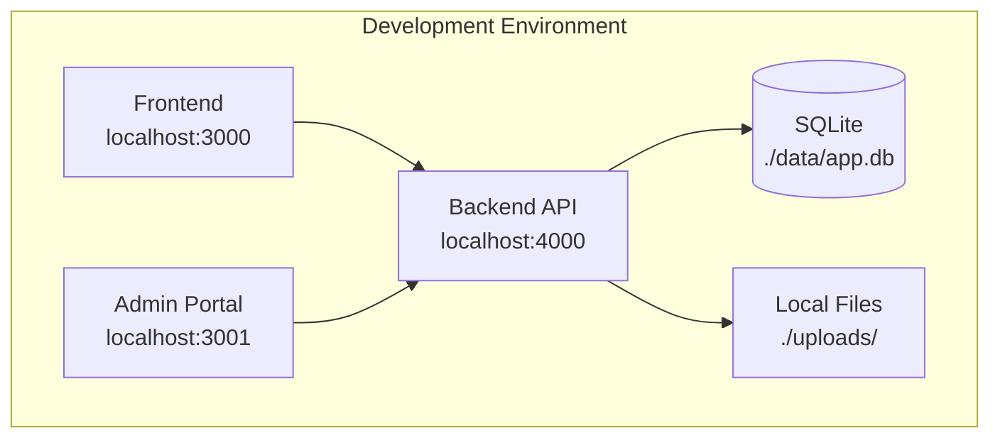
```mermaid
flowchart TB
    subgraph Dev["Development Environment"]
        DEV_FRONT["Frontend<br/>localhost:3000"]
        DEV_ADMIN["Admin Portal<br/>localhost:3001"]
        DEV_API["Backend API<br/>localhost:4000"]
        DEV_DB[("SQLite<br/>./data/app.db")]
        DEV_FILES["Local Files<br/>./uploads/"]
    end

    DEV_FRONT --> DEV_API
    DEV_ADMIN --> DEV_API
    DEV_API --> DEV_DB
    DEV_API --> DEV_FILES
```

### Production Architecture (Future)

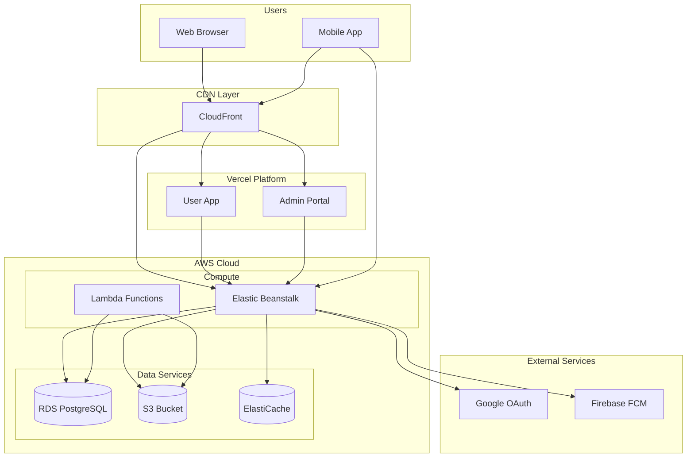
```mermaid
flowchart TB
    subgraph Users["Users"]
        BROWSER[Web Browser]
        PHONE[Mobile App]
    end

    subgraph CDN["CDN Layer"]
        CF[CloudFront]
    end

    subgraph Vercel["Vercel Platform"]
        FRONTEND[User App]
        ADMIN[Admin Portal]
    end

    subgraph AWS["AWS Cloud"]
        subgraph Compute["Compute"]
            EB[Elastic Beanstalk]
            LAMBDA[Lambda Functions]
        end

        subgraph Data["Data Services"]
            RDS[(RDS PostgreSQL)]
            S3[(S3 Bucket)]
            REDIS[(ElastiCache)]
        end
    end

    subgraph External["External Services"]
        GOOGLE[Google OAuth]
        FCM[Firebase FCM]
    end

    BROWSER --> CF
    PHONE --> CF
    CF --> FRONTEND
    CF --> ADMIN
    CF --> EB

    FRONTEND --> EB
    ADMIN --> EB
    PHONE --> EB

    EB --> RDS
    EB --> S3
    EB --> REDIS
    EB --> GOOGLE
    EB --> FCM

    LAMBDA --> S3
    LAMBDA --> RDS
```

### Infrastructure Components

| Component | Local Dev | Production |
|-----------|-----------|------------|
| **Frontend Hosting** | localhost:3000 | Vercel |
| **Admin Hosting** | localhost:3001 | Vercel (admin subdomain) |
| **Backend Hosting** | localhost:4000 | AWS Elastic Beanstalk |
| **Database** | SQLite | RDS PostgreSQL |
| **File Storage** | Local filesystem | S3 + CloudFront |
| **Session Cache** | In-memory | ElastiCache Redis |
| **Image Processing** | Sharp (sync) | Lambda (async) |
| **Push Notifications** | FCM (direct) | FCM via Lambda |

---

## Migration Path

### Phase 1: Local Development

```
Current State
├── SQLite database
├── Local file storage
├── JWT authentication
└── Single developer testing
```

### Phase 2: Personal Use

```
Personal Deployment
├── SQLite database (backed up)
├── Local/Dropbox file storage
├── JWT authentication
└── Deployed to personal server/Raspberry Pi
```

### Phase 3: Cloud Migration

```mermaid
flowchart LR
    subgraph Local["Local (Current)"]
        SQLITE[(SQLite)]
        FILES[Local Files]
        JWT[JWT Auth]
    end

    subgraph Migration["Migration Steps"]
        M1[Export Data]
        M2[Transform Schema]
        M3[Upload Files]
        M4[Add OAuth]
    end

    subgraph Cloud["Cloud (Future)"]
        RDS[(PostgreSQL)]
        S3[(S3)]
        OAUTH[Google OAuth]
    end

    SQLITE --> M1 --> M2 --> RDS
    FILES --> M3 --> S3
    JWT --> M4 --> OAUTH
```

### Migration Checklist

| Step | From | To | Complexity |
|------|------|-----|------------|
| Database | SQLite | PostgreSQL RDS | Medium |
| Schema | INTEGER PRIMARY KEY | SERIAL PRIMARY KEY | Low |
| Files | Local filesystem | S3 bucket | Medium |
| File URLs | Relative paths | S3/CloudFront URLs | Medium |
| Auth | JWT only | JWT + Google OAuth | Medium |
| Sessions | In-memory | Redis ElastiCache | Low |
| Deployment | Manual | CI/CD pipeline | Medium |

---

## Appendix

### Technology Stack Summary

| Layer | Technology | Purpose |
|-------|------------|---------|
| **Frontend** | Next.js 14+ | React framework with App Router |
| **Styling** | Tailwind CSS | Utility-first CSS |
| **Backend** | Express.js | Node.js web framework |
| **Database** | SQLite → PostgreSQL | Relational data storage |
| **ORM** | better-sqlite3 → Prisma | Database access |
| **Auth** | JWT (jsonwebtoken) | Token-based authentication |
| **Passwords** | bcrypt | Password hashing |
| **Validation** | express-validator | Input validation |
| **Security** | Helmet.js | HTTP security headers |
| **Images** | Sharp | Image processing |
| **Mobile** | React Native (Expo) | Cross-platform mobile |
| **Push** | Firebase Cloud Messaging | Mobile notifications |

### Key Design Patterns

| Pattern | Usage |
|---------|-------|
| **Repository Pattern** | Database access abstraction |
| **Service Layer** | Business logic encapsulation |
| **Middleware Chain** | Auth, validation, error handling |
| **JWT Bearer Auth** | Stateless authentication |
| **Pre-signed URLs** | Secure direct file uploads (S3) |

### Diagram Legend

| Symbol | Meaning |
|--------|---------|
| `[Box]` | System component |
| `[(Cylinder)]` | Database |
| `{Diamond}` | Decision point |
| `-->` | Data flow |
| `-.->` | Optional/future flow |
| `subgraph` | Logical grouping |

---

**Document History**

| Version | Date | Changes |
|---------|------|---------|
| 1.0 | January 2026 | Initial architecture documentation |
| 1.1 | January 20, 2026 | Updated to Google OAuth authentication (replaced email/password) |

---

*This document uses Mermaid diagrams. View in a Mermaid-compatible viewer (GitHub, GitLab, VS Code with extension) for best results.*
