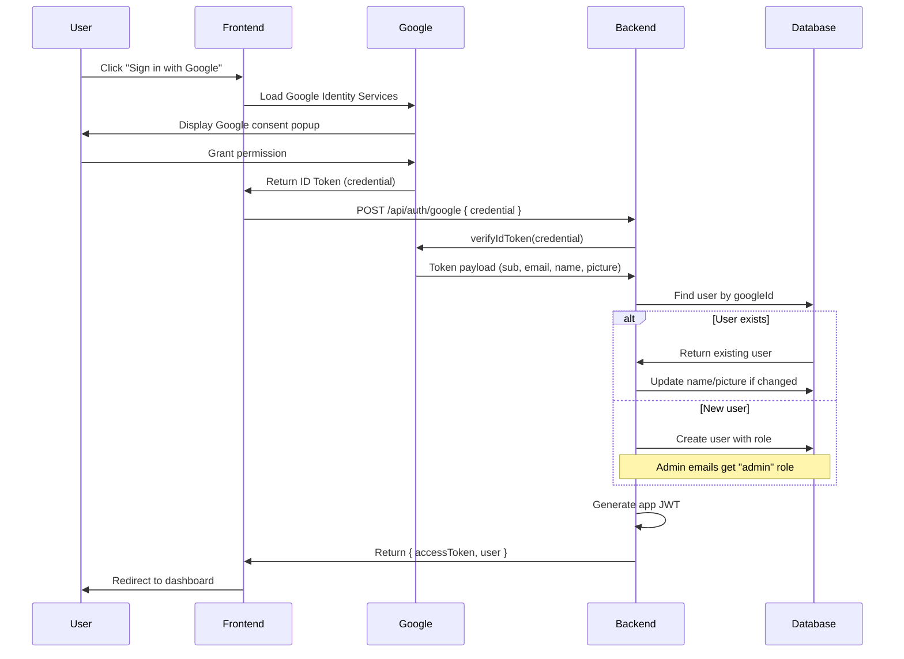

# Google OAuth Authentication

This document describes the Google OAuth implementation for the CSIRO Low-Carb Diet App using Google Identity Services (GIS).

## Overview

The app uses **Google Sign In with Google** for authentication. This approach:
- Eliminates password management complexity
- Provides trusted identity verification
- Supports automatic role assignment (admin/user)
- Returns user profile data (name, picture) from Google

## Authentication Flow



## API Endpoints

### POST /api/auth/google

Authenticate with a Google ID token.

**Request:**
```json
{
  "credential": "eyJhbGciOiJSUzI1NiIsInR5cCI6IkpXVCJ9..."
}
```

**Response (200 OK):**
```json
{
  "success": true,
  "data": {
    "accessToken": "eyJhbGciOiJIUzI1NiIsInR5cCI6IkpXVCJ9...",
    "tokenType": "Bearer",
    "expiresIn": 86400,
    "user": {
      "id": "clrx1234567890abcdef",
      "email": "user@example.com",
      "name": "John Doe",
      "picture": "https://lh3.googleusercontent.com/a/...",
      "role": "user",
      "hasProfile": false,
      "createdAt": "2026-01-20T10:00:00.000Z"
    }
  }
}
```

**Error Response (401 Unauthorized):**
```json
{
  "success": false,
  "error": {
    "code": "UNAUTHORIZED",
    "message": "Invalid Google token"
  }
}
```

### GET /api/auth/me

Get the current authenticated user.

**Headers:**
```
Authorization: Bearer <accessToken>
```

**Response (200 OK):**
```json
{
  "success": true,
  "data": {
    "id": "clrx1234567890abcdef",
    "email": "user@example.com",
    "name": "John Doe",
    "picture": "https://lh3.googleusercontent.com/a/...",
    "role": "user",
    "hasProfile": true,
    "createdAt": "2026-01-20T10:00:00.000Z"
  }
}
```

## User Roles

| Role | Description | Auto-Assigned To |
|------|-------------|------------------|
| `admin` | Full administrative access | `ayan.m.sasmal@gmail.com` |
| `user` | Standard user access | All other emails |

Role is determined at first login and stored in the database.

## Frontend Integration

### 1. Load Google Identity Services

```html
<script src="https://accounts.google.com/gsi/client" async></script>
```

### 2. Content Security Policy

Add these to your CSP headers:
```
Content-Security-Policy:
  script-src https://accounts.google.com/gsi/client;
  frame-src https://accounts.google.com/gsi/;
  connect-src https://accounts.google.com/gsi/;
```

### 3. Initialize Google Sign-In

```javascript
// Initialize Google Sign-In
google.accounts.id.initialize({
  client_id: 'YOUR_GOOGLE_CLIENT_ID.apps.googleusercontent.com',
  callback: handleCredentialResponse,
  auto_select: false,
});

// Render the button
google.accounts.id.renderButton(
  document.getElementById('google-signin-button'),
  {
    theme: 'outline',
    size: 'large',
    text: 'signin_with',
    shape: 'rectangular',
  }
);

// Handle the response
async function handleCredentialResponse(response) {
  const { credential } = response;

  // Send to backend
  const result = await fetch('/api/auth/google', {
    method: 'POST',
    headers: { 'Content-Type': 'application/json' },
    body: JSON.stringify({ credential }),
  });

  const data = await result.json();

  if (data.success) {
    // Store token and redirect
    localStorage.setItem('accessToken', data.data.accessToken);
    window.location.href = '/dashboard';
  } else {
    console.error('Login failed:', data.error);
  }
}
```

### 4. React Example

```tsx
import { useEffect } from 'react';

declare global {
  interface Window {
    google: any;
  }
}

export function GoogleSignInButton() {
  useEffect(() => {
    // Load Google Identity Services
    const script = document.createElement('script');
    script.src = 'https://accounts.google.com/gsi/client';
    script.async = true;
    script.onload = () => {
      window.google.accounts.id.initialize({
        client_id: process.env.NEXT_PUBLIC_GOOGLE_CLIENT_ID,
        callback: handleCredentialResponse,
      });

      window.google.accounts.id.renderButton(
        document.getElementById('google-signin'),
        { theme: 'outline', size: 'large' }
      );
    };
    document.body.appendChild(script);
  }, []);

  const handleCredentialResponse = async (response: { credential: string }) => {
    const res = await fetch('/api/auth/google', {
      method: 'POST',
      headers: { 'Content-Type': 'application/json' },
      body: JSON.stringify({ credential: response.credential }),
    });

    const data = await res.json();
    if (data.success) {
      // Handle successful login
    }
  };

  return <div id="google-signin" />;
}
```

## Backend Token Verification

The backend uses `google-auth-library` to verify tokens:

```typescript
import { OAuth2Client } from 'google-auth-library';

const client = new OAuth2Client(GOOGLE_CLIENT_ID);

async function verifyGoogleToken(credential: string) {
  const ticket = await client.verifyIdToken({
    idToken: credential,
    audience: GOOGLE_CLIENT_ID,
  });

  const payload = ticket.getPayload();
  // payload contains: sub, email, name, picture, email_verified
  return payload;
}
```

## Database Schema

```prisma
model User {
  id           String   @id @default(cuid())
  email        String   @unique
  googleId     String   @unique @map("google_id")
  name         String?
  picture      String?  // Google profile picture URL
  role         String   @default("user") // "user" or "admin"
  createdAt    DateTime @default(now()) @map("created_at")
  updatedAt    DateTime @updatedAt @map("updated_at")

  // Relations
  profile      UserProfile?
  weightLogs   WeightLog[]
  glucoseLogs  GlucoseLog[]

  @@map("users")
}
```

## Security Considerations

### Why Google's `sub` Claim?

- **Immutable**: The `sub` (subject) claim never changes for a user
- **Unique**: Guaranteed unique across all Google accounts
- **Email can change**: Users can change their Google email, but `sub` stays the same

### Token Verification

1. **Signature validation**: Google's public keys verify the token wasn't tampered with
2. **Audience check**: Ensures token was issued for YOUR app
3. **Expiry check**: Tokens are short-lived (typically 1 hour)

### App JWT

After Google verification, we issue our own JWT:
- Contains: `sub` (user ID), `email`, `role`
- Expires: 24 hours (configurable)
- Used for all subsequent API requests

## Environment Variables

```env
# Google OAuth (from Google Cloud Console)
GOOGLE_CLIENT_ID="your-client-id.apps.googleusercontent.com"
GOOGLE_CLIENT_SECRET="your-client-secret"
```

## Getting Google Credentials

1. Go to [Google Cloud Console](https://console.cloud.google.com/apis/credentials)
2. Create a new project or select existing
3. Go to **APIs & Services** > **Credentials**
4. Click **Create Credentials** > **OAuth client ID**
5. Select **Web application**
6. Add authorized JavaScript origins:
   - `http://localhost:3000` (development)
   - `https://yourdomain.com` (production)
7. Copy the Client ID and Client Secret

## Testing

### Manual Testing

1. Start the backend: `npm run start:dev`
2. Open Swagger UI: `http://localhost:3000/api/docs`
3. Get a Google ID token from a frontend implementation
4. Call `POST /api/auth/google` with the credential
5. Use the returned `accessToken` for subsequent requests

### Test Users

| Email | Expected Role |
|-------|---------------|
| `ayan.m.sasmal@gmail.com` | admin |
| `ayandelhi@gmail.com` | user |

## References

- [Google Identity Services Overview](https://developers.google.com/identity/gsi/web/guides/overview)
- [Get Google API Client ID](https://developers.google.com/identity/gsi/web/guides/get-google-api-clientid)
- [Verify Google ID Tokens](https://developers.google.com/identity/gsi/web/guides/verify-google-id-token)
- [google-auth-library (Node.js)](https://www.npmjs.com/package/google-auth-library)

---

*Last Updated: January 20, 2026*
