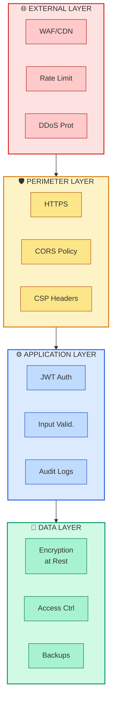
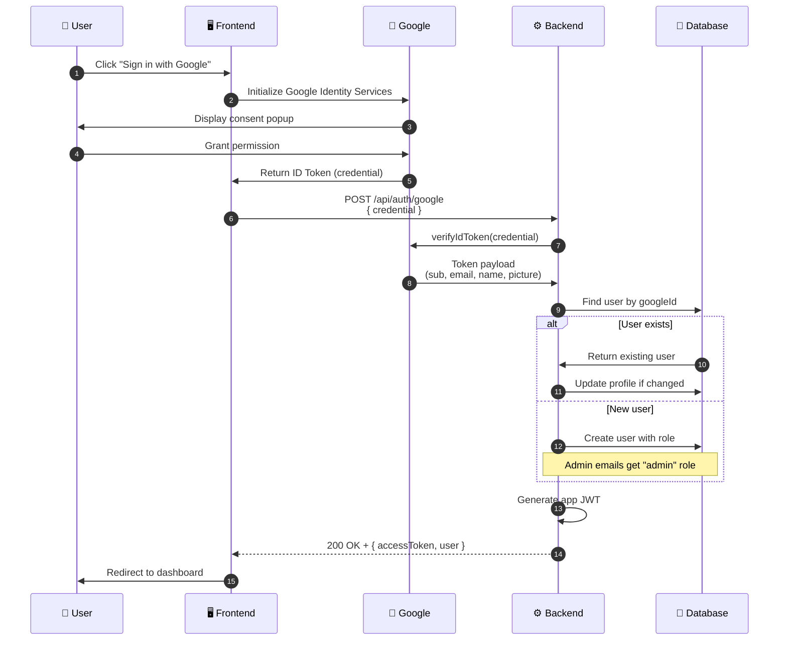

# CSIRO Low-Carb Diet App - Security Documentation

**Version:** 1.1
**Last Updated:** January 20, 2026
**Classification:** Internal
**Document Owner:** Development Team

---

## Table of Contents

1. [Executive Summary](#executive-summary)
2. [Security Architecture](#security-architecture)
3. [Authentication & Authorization](#authentication--authorization)
4. [Data Protection](#data-protection)
5. [API Security](#api-security)
6. [Mobile App Security](#mobile-app-security)
7. [Admin Portal Security](#admin-portal-security)
8. [Compliance & Privacy](#compliance--privacy)
9. [Threat Modeling](#threat-modeling)
10. [Security Best Practices](#security-best-practices)
11. [Incident Response Plan](#incident-response-plan)
12. [Appendix](#appendix)

---

## Executive Summary

### Purpose

This document outlines the security architecture, controls, and best practices for the CSIRO Low-Carb Diet App platform. The application handles sensitive personal health information (PHI) and must maintain the highest standards of security and privacy.

### Scope

This security documentation covers:

- **User-facing web application** (Next.js frontend)
- **Admin portal** (separate Next.js application)
- **Mobile application** (React Native)
- **Backend API** (Node.js/Express)
- **Data storage** (SQLite local → PostgreSQL production)
- **File storage** (Local filesystem → S3 production)

### Security Objectives

| Objective | Description |
|-----------|-------------|
| **Confidentiality** | Protect user health data from unauthorized access |
| **Integrity** | Ensure data accuracy and prevent unauthorized modifications |
| **Availability** | Maintain system uptime and reliable access to health tracking features |
| **Privacy** | Comply with privacy regulations and respect user data rights |

### Risk Classification

The application is classified as **HIGH SENSITIVITY** due to:

- Personal health information (weight, glucose readings, meal data)
- User identifiable information (email, profile data)
- Dietary and medical condition indicators (pre-diabetes management)

---

## Security Architecture

### Defense-in-Depth Model



### Component Security Overview

| Component | Security Controls |
|-----------|-------------------|
| **Frontend (Next.js)** | CSP, XSS protection, HTTPS-only, secure cookies |
| **Backend (Express)** | Helmet.js, rate limiting, input validation, JWT |
| **Database (SQLite/PostgreSQL)** | Encrypted at rest, parameterized queries, access control |
| **File Storage** | Secure paths, type validation, size limits, virus scanning |
| **Mobile App** | Certificate pinning, secure storage, biometric auth |
| **Admin Portal** | IP whitelisting, MFA (future), audit logging |

---

## Authentication & Authorization

### Authentication Flow

#### User Authentication (Google OAuth + JWT)



#### JWT Token Structure

```javascript
// Access Token Payload
{
  "sub": "user_id",           // Subject (user ID)
  "email": "user@example.com",
  "role": "user",             // user | admin
  "iat": 1704067200,          // Issued at
  "exp": 1704153600           // Expiration (24 hours)
}
```

#### Token Configuration

| Setting | Value | Rationale |
|---------|-------|-----------|
| **Access Token Expiry** | 24 hours | Balance security with UX |
| **Refresh Token Expiry** | 7 days | Allow extended sessions |
| **Algorithm** | HS256 | Symmetric, fast, suitable for single-service |
| **Secret Length** | 256 bits minimum | Cryptographically secure |

### Google OAuth Security

#### Security Benefits

| Benefit | Description |
|---------|-------------|
| **No Password Storage** | Eliminates password-related vulnerabilities |
| **Google's Infrastructure** | Leverages Google's security team and 2FA |
| **Token Verification** | Cryptographic signature validation |
| **Immutable User ID** | Google's `sub` claim never changes |
| **Short-lived Tokens** | Google ID tokens expire quickly (~1 hour) |

#### Token Verification Implementation

```typescript
// Server-side Google ID token verification
import { OAuth2Client } from 'google-auth-library';

const client = new OAuth2Client(process.env.GOOGLE_CLIENT_ID);

async function verifyGoogleToken(credential: string) {
  const ticket = await client.verifyIdToken({
    idToken: credential,
    audience: process.env.GOOGLE_CLIENT_ID,  // Verify token was issued for our app
  });

  const payload = ticket.getPayload();
  // payload contains: sub (unique ID), email, name, picture, email_verified
  return payload;
}
```

#### Why Google's `sub` Claim?

| Property | Explanation |
|----------|-------------|
| **Immutable** | The `sub` (subject) claim never changes for a user |
| **Unique** | Guaranteed unique across all Google accounts |
| **Email Can Change** | Users can change their email, but `sub` stays the same |
| **Prevents Account Takeover** | Even if email changes, user identity is preserved |

### Authorization Model

#### Role-Based Access Control

| Role | Permissions |
|------|-------------|
| **User** | Read/write own data, view public recipes |
| **Admin** | Full recipe/food management, user administration, audit log access |

#### Admin Access Control

Admin users are managed through an email whitelist stored in the database:

```sql
-- Admin whitelist check
SELECT * FROM admin_users
WHERE email = ? AND is_active = TRUE;
```

#### Resource-Level Authorization

```javascript
// Middleware to verify resource ownership
const verifyOwnership = async (req, res, next) => {
  const resourceUserId = req.params.userId || req.body.userId;
  const currentUserId = req.user.sub;

  if (resourceUserId !== currentUserId && req.user.role !== 'admin') {
    return res.status(403).json({
      error: 'Access denied: You can only access your own data'
    });
  }
  next();
};
```

---

## Data Protection

### Data Classification

| Classification | Description | Examples | Controls |
|----------------|-------------|----------|----------|
| **Restricted** | Highly sensitive personal data | Glucose readings, health metrics | Encryption, access logging, MFA |
| **Confidential** | Personal identifiable information | Email, name, profile | Encryption, access control |
| **Internal** | Business data | Recipes, food database | Access control |
| **Public** | Non-sensitive data | Published recipes | Basic access control |

### Encryption Standards

#### Data at Rest

| Data Type | Encryption Method |
|-----------|-------------------|
| **Database** | AES-256 (SQLite SEE / PostgreSQL pgcrypto) |
| **File Storage** | AES-256 (S3 SSE-S3 in production) |
| **Backups** | AES-256 with separate key |
| **Credentials** | N/A (Google OAuth - no local passwords), AES-256 (app tokens) |

#### Data in Transit

| Channel | Protocol | Minimum Version |
|---------|----------|-----------------|
| **API Requests** | TLS | 1.2 |
| **WebSocket** | WSS | TLS 1.2 |
| **Mobile API** | TLS | 1.2 with cert pinning |

### Sensitive Data Handling

#### PII Fields

The following fields are classified as PII and require special handling:

```javascript
const PII_FIELDS = [
  'email',
  'name',
  'height_cm',
  'weight_kg',
  'age',
  'sex',
  'target_weight_kg',
  'glucose_mmol_l',
  'notes'  // May contain health information
];
```

#### Data Minimization

- Only collect data necessary for app functionality
- Glucose notes are optional
- Meal photos are user-discretionary
- No location tracking required

### Data Retention

| Data Type | Retention Period | Justification |
|-----------|------------------|---------------|
| **User Account** | Until deletion requested | Core functionality |
| **Weight/Glucose Logs** | Indefinite (user-controlled) | Historical tracking value |
| **Meal Images** | Indefinite (user-controlled) | User's meal diary |
| **Audit Logs** | 2 years | Compliance and security |
| **Session Tokens** | 7 days | Security best practice |

---

## API Security

### OWASP Top 10 Mitigations

#### 1. Injection Prevention

```javascript
// Use parameterized queries (better-sqlite3)
const stmt = db.prepare('SELECT * FROM users WHERE email = ?');
const user = stmt.get(email);

// NEVER do this:
// db.exec(`SELECT * FROM users WHERE email = '${email}'`);
```

#### 2. Broken Authentication

- JWT tokens with short expiry (24 hours)
- Google OAuth for identity verification (no passwords to steal)
- Google's ID token verification with cryptographic validation
- Rate limiting on auth endpoints

#### 3. Sensitive Data Exposure

- HTTPS-only communication
- Encryption at rest for all databases
- No sensitive data in URLs or logs
- Secure response headers

#### 4. XML External Entities (XXE)

- No XML parsing in the application
- JSON-only API communication

#### 5. Broken Access Control

```javascript
// Always verify ownership before data access
router.get('/users/:userId/logs',
  authMiddleware,
  verifyOwnership,
  getUserLogs
);
```

#### 6. Security Misconfiguration

```javascript
// Helmet.js configuration
app.use(helmet({
  contentSecurityPolicy: {
    directives: {
      defaultSrc: ["'self'"],
      scriptSrc: ["'self'"],
      styleSrc: ["'self'", "'unsafe-inline'"],
      imgSrc: ["'self'", "data:", "blob:"],
      connectSrc: ["'self'"]
    }
  },
  hsts: {
    maxAge: 31536000,
    includeSubDomains: true,
    preload: true
  }
}));
```

#### 7. Cross-Site Scripting (XSS)

- React's automatic escaping
- CSP headers to prevent inline scripts
- Input sanitization on all user inputs
- HTTPOnly cookies for tokens

#### 8. Insecure Deserialization

- No serialized objects in storage
- JSON.parse with error handling
- Schema validation on all inputs

#### 9. Using Components with Known Vulnerabilities

- Regular `npm audit` checks
- Dependabot alerts enabled
- Monthly dependency updates
- Lock file for reproducible builds

#### 10. Insufficient Logging & Monitoring

```javascript
// Comprehensive audit logging
const auditLog = (userId, action, resource, details) => {
  logger.info({
    timestamp: new Date().toISOString(),
    userId,
    action,
    resource,
    details,
    ip: req.ip,
    userAgent: req.headers['user-agent']
  });
};
```

### Rate Limiting

```javascript
const rateLimit = require('express-rate-limit');

// General API rate limit
const apiLimiter = rateLimit({
  windowMs: 15 * 60 * 1000, // 15 minutes
  max: 100, // requests per window
  message: { error: 'Too many requests, please try again later' }
});

// Strict limit for auth endpoints
const authLimiter = rateLimit({
  windowMs: 15 * 60 * 1000,
  max: 5, // Only 5 login attempts per 15 minutes
  message: { error: 'Too many login attempts, please try again later' }
});

app.use('/api/', apiLimiter);
app.use('/api/auth/', authLimiter);
```

### Input Validation

```javascript
const { body, validationResult } = require('express-validator');

// Example: Weight log validation
const validateWeightLog = [
  body('weight_kg')
    .isFloat({ min: 20, max: 500 })
    .withMessage('Weight must be between 20 and 500 kg'),
  body('log_date')
    .isISO8601()
    .withMessage('Invalid date format'),
  (req, res, next) => {
    const errors = validationResult(req);
    if (!errors.isEmpty()) {
      return res.status(400).json({
        success: false,
        errors: errors.array()
      });
    }
    next();
  }
];
```

### CORS Configuration

```javascript
const cors = require('cors');

const corsOptions = {
  origin: [
    'http://localhost:3000',        // Frontend dev
    'http://localhost:3001',        // Admin portal dev
    'https://app.csiro-diet.app',   // Production frontend
    'https://admin.csiro-diet.app'  // Production admin
  ],
  credentials: true,
  methods: ['GET', 'POST', 'PUT', 'DELETE', 'PATCH'],
  allowedHeaders: ['Content-Type', 'Authorization']
};

app.use(cors(corsOptions));
```

---

## Mobile App Security

### Secure Storage

```javascript
// React Native secure storage for tokens
import * as SecureStore from 'expo-secure-store';

// Store token securely
await SecureStore.setItemAsync('auth_token', token, {
  keychainAccessible: SecureStore.WHEN_UNLOCKED
});

// Retrieve token
const token = await SecureStore.getItemAsync('auth_token');
```

### Certificate Pinning

```javascript
// Pin SSL certificate for API communication
const sslPinning = {
  certs: ['sha256/AAAAAAAAAAAAAAAAAAAAAAAAAAAAAAAAAAAAAAAAAAA=']
};
```

### Biometric Authentication (Future Enhancement)

```javascript
// Use device biometrics for sensitive operations
import * as LocalAuthentication from 'expo-local-authentication';

const authenticate = async () => {
  const result = await LocalAuthentication.authenticateAsync({
    promptMessage: 'Authenticate to view health data',
    fallbackLabel: 'Use passcode'
  });
  return result.success;
};
```

### Camera & Image Security

| Control | Implementation |
|---------|----------------|
| **Permission Request** | Request only when needed |
| **Image Compression** | Resize and compress before upload |
| **Metadata Stripping** | Remove EXIF data (location, device info) |
| **Secure Upload** | Pre-signed URLs, size limits |

```javascript
// Strip EXIF data before upload
const processImage = async (uri) => {
  const manipulated = await ImageManipulator.manipulateAsync(
    uri,
    [{ resize: { width: 1200 } }],
    { compress: 0.8, format: 'webp' }
  );
  return manipulated.uri;
};
```

### Push Notification Security

- Use Firebase Cloud Messaging (FCM) with server keys
- Never include sensitive data in notification payload
- Notification content should be generic reminders
- User controls notification preferences

---

## Admin Portal Security

### Access Control

| Control | Implementation |
|---------|----------------|
| **Authentication** | Separate admin JWT with elevated claims |
| **Authorization** | Email whitelist check on every request |
| **Session** | Shorter expiry (8 hours) than user sessions |
| **IP Restriction** | Optional IP whitelist (production) |

### Admin Authentication Flow

```javascript
// Admin middleware
const adminMiddleware = async (req, res, next) => {
  try {
    // Verify JWT
    const decoded = jwt.verify(req.token, process.env.JWT_SECRET);

    // Check admin whitelist
    const admin = await db.prepare(
      'SELECT * FROM admin_users WHERE email = ? AND is_active = TRUE'
    ).get(decoded.email);

    if (!admin) {
      return res.status(403).json({ error: 'Admin access required' });
    }

    req.admin = admin;
    next();
  } catch (error) {
    res.status(401).json({ error: 'Invalid or expired token' });
  }
};
```

### Audit Logging

All admin actions are logged for compliance and security review:

```javascript
// Log all admin actions
const logAdminAction = async (adminId, action, entityType, entityId, details) => {
  await db.prepare(`
    INSERT INTO admin_audit_log
    (admin_id, action, entity_type, entity_id, details, ip_address, created_at)
    VALUES (?, ?, ?, ?, ?, ?, datetime('now'))
  `).run(adminId, action, entityType, entityId, JSON.stringify(details), req.ip);
};

// Usage
await logAdminAction(
  req.admin.id,
  'CREATE',
  'recipe',
  newRecipe.id,
  { name: newRecipe.name }
);
```

### Sensitive Operations

| Operation | Additional Controls |
|-----------|---------------------|
| **User Deactivation** | Requires confirmation, logs reason |
| **Data Export** | Audit logged, rate limited |
| **Bulk Import** | Validated, preview before commit |
| **Admin Creation** | Requires existing admin approval |

---

## Compliance & Privacy

### GDPR Compliance

#### User Rights Implementation

| Right | Implementation |
|-------|----------------|
| **Right to Access** | Data export endpoint returns all user data |
| **Right to Rectification** | Profile edit endpoints available |
| **Right to Erasure** | Account deletion removes all associated data |
| **Right to Portability** | Export in JSON and CSV formats |
| **Right to Object** | Users can disable non-essential features |

#### Data Export Endpoint

```javascript
// GET /api/users/:userId/export
router.get('/users/:userId/export',
  authMiddleware,
  verifyOwnership,
  async (req, res) => {
    const userId = req.params.userId;

    // Gather all user data
    const exportData = {
      profile: await getUserProfile(userId),
      weightLogs: await getWeightLogs(userId),
      glucoseLogs: await getGlucoseLogs(userId),
      mealLogs: await getMealLogs(userId),
      preferences: await getUserPreferences(userId),
      exportDate: new Date().toISOString()
    };

    res.json(exportData);
  }
);
```

#### Account Deletion

```javascript
// DELETE /api/users/:userId
router.delete('/users/:userId',
  authMiddleware,
  verifyOwnership,
  async (req, res) => {
    const userId = req.params.userId;

    // Delete all user data (cascading)
    await db.prepare('DELETE FROM users WHERE id = ?').run(userId);

    // Delete user's meal images from storage
    await deleteUserImages(userId);

    // Log for audit (anonymized)
    auditLog(null, 'ACCOUNT_DELETED', 'user', null);

    res.json({ success: true, message: 'Account deleted' });
  }
);
```

### Privacy by Design

| Principle | Implementation |
|-----------|----------------|
| **Proactive** | Security built into design phase |
| **Default Privacy** | Minimal data collection by default |
| **Privacy Embedded** | Security controls in every feature |
| **Full Functionality** | Security doesn't compromise UX |
| **End-to-End Security** | Data protected throughout lifecycle |
| **Visibility** | Clear privacy policy and controls |
| **User-Centric** | Users control their data |

### Cookie Policy

```javascript
// Session cookie configuration
const sessionConfig = {
  name: 'csiro_session',
  httpOnly: true,       // Not accessible via JavaScript
  secure: true,         // HTTPS only in production
  sameSite: 'strict',   // CSRF protection
  maxAge: 24 * 60 * 60 * 1000  // 24 hours
};
```

---

## Threat Modeling

### STRIDE Analysis

| Threat | Category | Mitigation |
|--------|----------|------------|
| **Spoofing** | Identity | JWT validation, Google OAuth token verification |
| **Tampering** | Data Integrity | Input validation, parameterized queries |
| **Repudiation** | Non-repudiation | Comprehensive audit logging |
| **Information Disclosure** | Confidentiality | Encryption, access controls |
| **Denial of Service** | Availability | Rate limiting, CDN protection |
| **Elevation of Privilege** | Authorization | RBAC, ownership verification |

### Attack Surface Analysis

| Surface | Threats | Controls |
|---------|---------|----------|
| **Auth Endpoint** | Token replay, invalid tokens | Google token verification, rate limiting |
| **API Endpoints** | Injection, parameter tampering | Input validation, parameterized queries |
| **File Upload** | Malware, path traversal | Type validation, secure naming |
| **Admin Portal** | Unauthorized access | Email whitelist, audit logging |
| **Mobile App** | Token theft, reverse engineering | Secure storage, obfuscation |

### Risk Assessment Matrix

| Risk | Likelihood | Impact | Priority | Mitigation |
|------|------------|--------|----------|------------|
| **Token Theft** | Medium | High | Critical | Google OAuth, secure cookies, short-lived tokens |
| **SQL Injection** | Low | Critical | Critical | Parameterized queries |
| **XSS Attack** | Medium | Medium | High | CSP, output encoding |
| **Data Breach** | Low | Critical | Critical | Encryption, access control |
| **DDoS Attack** | Medium | High | High | CDN, rate limiting |
| **Insider Threat** | Low | High | Medium | Audit logging, access reviews |

---

## Security Best Practices

### Development Guidelines

#### Code Security

1. **Never commit secrets** - Use environment variables
2. **Validate all inputs** - Use express-validator
3. **Parameterize queries** - Never concatenate SQL
4. **Handle errors safely** - Don't expose stack traces
5. **Log security events** - Authentication, authorization failures
6. **Review dependencies** - Run `npm audit` regularly

#### Secure Coding Checklist

```markdown
- [ ] All user inputs validated and sanitized
- [ ] Parameterized queries used for database access
- [ ] Sensitive data encrypted at rest
- [ ] HTTPS enforced for all communications
- [ ] Authentication required for protected endpoints
- [ ] Authorization checks verify resource ownership
- [ ] Error messages don't leak sensitive information
- [ ] Logging captures security events without PII
- [ ] Dependencies scanned for vulnerabilities
- [ ] Secrets stored in environment variables
```

### Deployment Security

#### Environment Configuration

```bash
# Production environment variables (example structure)
NODE_ENV=production
JWT_SECRET=<256-bit-random-secret>
DATABASE_URL=<encrypted-connection-string>
S3_BUCKET_NAME=<bucket-name>
ALLOWED_ORIGINS=https://app.csiro-diet.app,https://admin.csiro-diet.app
```

#### CI/CD Security

| Stage | Security Check |
|-------|----------------|
| **Build** | npm audit, dependency scan |
| **Test** | Security unit tests |
| **Deploy** | Secrets injection from vault |
| **Production** | WAF, monitoring enabled |

### Monitoring & Alerting

#### Security Events to Monitor

| Event | Alert Level | Response |
|-------|-------------|----------|
| **Multiple failed logins** | Warning | Review, potential lockout |
| **Admin access from new IP** | Warning | Verify legitimacy |
| **Unusual data export volume** | Warning | Investigate user activity |
| **SQL error patterns** | Critical | Potential injection attempt |
| **Token verification failures** | Warning | Potential token theft |

---

## Incident Response Plan

### Incident Classification

| Severity | Description | Examples | Response Time |
|----------|-------------|----------|---------------|
| **Critical** | Active breach, data exposure | Database compromise, credential leak | Immediate |
| **High** | Security vulnerability exploited | Successful injection, XSS | < 4 hours |
| **Medium** | Attempted attack, no success | Failed brute force, scanning | < 24 hours |
| **Low** | Security misconfiguration | Missing headers, weak settings | < 1 week |

### Response Procedure

#### 1. Detection & Identification

```markdown
- [ ] Identify the incident type and scope
- [ ] Document initial findings with timestamps
- [ ] Assess affected systems and data
- [ ] Determine if incident is ongoing
```

#### 2. Containment

```markdown
- [ ] Isolate affected systems if necessary
- [ ] Revoke compromised credentials
- [ ] Block malicious IP addresses
- [ ] Preserve evidence for analysis
```

#### 3. Eradication

```markdown
- [ ] Identify root cause
- [ ] Remove malicious artifacts
- [ ] Patch vulnerabilities
- [ ] Verify removal complete
```

#### 4. Recovery

```markdown
- [ ] Restore systems from clean backups
- [ ] Re-enable services incrementally
- [ ] Monitor for recurrence
- [ ] Verify normal operation
```

#### 5. Post-Incident

```markdown
- [ ] Document lessons learned
- [ ] Update security controls
- [ ] Notify affected users if required
- [ ] File compliance reports if necessary
```

### Communication Plan

| Stakeholder | When to Notify | Method |
|-------------|----------------|--------|
| **Development Team** | Immediately | Slack/direct message |
| **Affected Users** | Within 72 hours of breach | Email |
| **Regulatory Bodies** | Per legal requirements | Official channels |

---

## Appendix

### A. Security Checklist by MVP

#### MVP-0: Foundation

- [x] JWT authentication implemented
- [x] Google OAuth integration (no password storage)
- [x] Google ID token verification with `google-auth-library`
- [x] Role-based access control (user/admin)
- [x] Input validation on all endpoints (class-validator)
- [ ] HTTPS configuration ready
- [x] Basic rate limiting enabled
- [x] Error handling doesn't expose internals

#### MVP-1: Food Search

- [ ] SQL injection prevention verified
- [ ] Search input sanitized
- [ ] No sensitive data in search results
- [ ] Rate limiting on search endpoints

#### MVP-2: Meal Logging

- [ ] Image upload size limits enforced
- [ ] File type validation (images only)
- [ ] Secure file naming (no user input in paths)
- [ ] Images stored outside web root
- [ ] EXIF data stripped from uploads

#### MVP-3: Admin Portal

- [ ] Admin authentication separated
- [ ] Email whitelist implemented
- [ ] All actions audit logged
- [ ] CSRF protection enabled
- [ ] Session timeout configured (8 hours)

#### MVP-4: Mobile App

- [ ] Secure storage for tokens
- [ ] Certificate pinning implemented
- [ ] Biometric authentication (optional)
- [ ] Camera permissions handled correctly
- [ ] Push notifications don't contain PHI

### B. Security Tools

| Category | Tool | Purpose |
|----------|------|---------|
| **Dependency Scanning** | npm audit | Known vulnerability detection |
| **Static Analysis** | ESLint security plugin | Code vulnerability detection |
| **Secret Scanning** | git-secrets | Prevent credential commits |
| **Penetration Testing** | OWASP ZAP | Web application scanning |
| **API Testing** | Postman/Insomnia | Manual security testing |

### C. Reference Documents

- OWASP Top 10 (2021)
- OWASP Mobile Top 10
- NIST Cybersecurity Framework
- GDPR Articles 13-22 (Data Subject Rights)
- Australian Privacy Principles

### D. Glossary

| Term | Definition |
|------|------------|
| **JWT** | JSON Web Token - compact, self-contained token for secure information transmission |
| **bcrypt** | Password hashing function with built-in salt (not used - Google OAuth) |
| **CSP** | Content Security Policy - HTTP header to prevent XSS |
| **CORS** | Cross-Origin Resource Sharing - browser security mechanism |
| **PHI** | Personal Health Information |
| **PII** | Personally Identifiable Information |
| **RBAC** | Role-Based Access Control |
| **XSS** | Cross-Site Scripting attack |
| **CSRF** | Cross-Site Request Forgery attack |
| **WAF** | Web Application Firewall |

### E. Document History

| Version | Date | Author | Changes |
|---------|------|--------|---------|
| 1.0 | January 2026 | Development Team | Initial security documentation |
| 1.1 | January 2026 | Development Team | Updated auth flow to Google OAuth (removed email/password authentication) |

---

**Document Classification:** Internal
**Review Schedule:** Quarterly
**Next Review:** April 2026

---

*This document should be treated as a living document and updated as the application evolves and new security considerations arise.*
