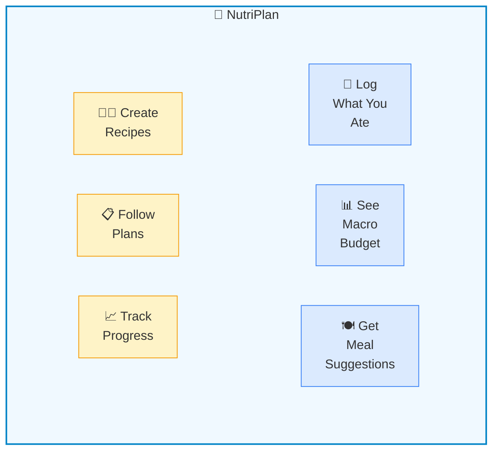
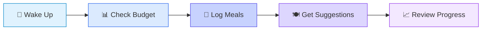

# NutriPlan — Solution on a Page

> **Evolved from**: CSIRO Low-Carb Diet App
> **New Direction**: Plan-agnostic nutrition platform with B2B potential
> **Updated**: January 24, 2026

---

## 🎯 The Problem

> **"I want to follow a diet plan, but I'm overwhelmed by tracking, confused about what to eat next, and lose motivation without guidance."**

Current nutrition apps:
- **Track** what you ate, but don't **guide** what to eat next
- Offer generic plans without personalization
- Require tedious data entry leading to tracking fatigue
- Don't connect users with dieticians effectively

### For Dieticians
- Manual spreadsheets for client plans
- No real-time visibility into client adherence
- Can't easily scale their practice digitally

---

## 💡 The Solution

A **plan-agnostic nutrition platform** that:
1. **Guides** users on what to eat (not just logs what they ate)
2. Supports **multiple diet plans** via configuration, not code
3. Enables **dieticians** to create and manage client plans
4. Lets users **create and share recipes** with calculated nutrition



---

## 🔑 Key Differentiators

| vs. Competitors | NutriPlan Advantage |
|-----------------|---------------------|
| MyFitnessPal | **Simpler** - Fewer features, less overwhelming |
| Noom | **Science-backed plans** - Configurable, research-based |
| Generic apps | **Meal planning focus** - Guides what to eat next |
| All apps | **B2B for dieticians** - Create, publish, manage client plans |

---

## 🚀 MVP Roadmap (Revised)

| Phase | What It Does | Key Features | Status |
|-------|--------------|--------------|--------|
| **MVP-0** | Foundation | Auth, profile, BMR/BMI, weight/glucose tracking | ✅ Done |
| **MVP-1** | Nutrition Engine | Food logging, nutrition plans, macro budget tracker, recipes | 🚧 In Progress |
| **MVP-2** | Meal Planning | Meal suggestions based on budget, search/filter, weekly plans | Planned |
| **MVP-3** | Insights | Progress reports, correlations, streaks, projections | Planned |
| **MVP-4** | B2B Portal | Dietician accounts, client management, plan marketplace | Future |
| **MVP-5** | Mobile | React Native app, offline support, push notifications | Future |

---

## 🏗️ Architecture Overview

```
┌─────────────────────────────────────────────────────────────────┐
│                    NutriPlan Architecture                        │
├─────────────────────────────────────────────────────────────────┤
│                                                                  │
│  ┌──────────────┐                      ┌──────────────┐         │
│  │   Frontend   │◀────────────────────▶│   Backend    │         │
│  │  (Next.js)   │                      │  (NestJS)    │         │
│  └──────────────┘                      └──────┬───────┘         │
│         │                                     │                  │
│         │    ┌────────────────────────┐       │                  │
│         └───▶│  Rule Evaluation       │◀──────┘                  │
│              │  Engine (Pure Funcs)   │                          │
│              └────────────────────────┘                          │
│                          │                                       │
│  ┌───────────────────────▼───────────────────────────┐          │
│  │                   Database                         │          │
│  │  Users │ Plans │ Foods │ Recipes │ Logs │ Rules   │          │
│  └────────────────────────────────────────────────────┘         │
│                                                                  │
└─────────────────────────────────────────────────────────────────┘
```

### Core Technical Decisions

| Area | Choice | Rationale |
|------|--------|-----------|
| **Plans** | JSON config in DB | New plans via config, not code |
| **Rules** | Pure functions | Testable, runs frontend + backend |
| **Auth** | Google OAuth + JWT | Simple, no passwords |
| **Database** | SQLite → PostgreSQL | Start simple, scale later |

---

## 🎯 Nutrition Plan Engine

Plans are **configuration, not code**:

```json
{
  "name": "Low Carb",
  "dailyTargets": {
    "calories": { "target": 1800 },
    "protein": { "min": 120 },
    "carbs": { "max": 80 },
    "fat": { "min": 60, "max": 90 }
  },
  "rules": [
    { "type": "proteinPerMealMinimum", "minGrams": 30 },
    { "type": "preferNetCarbs" }
  ]
}
```

**Benefits**:
- Add new plans without code changes
- Users can customize plans
- Dieticians can create client-specific plans
- Rule engine returns **reasons**, not just pass/fail

---

## 👤 User Journeys

### Journey 1: Daily User



### Journey 2: Recipe Creator

```
[Create Recipe] → [Add Ingredients] → [Auto-calc Nutrition] → [Share or Keep Private]
```

### Journey 3: Dietician (Future)

```
[Create Plan] → [Assign to Client] → [Monitor Progress] → [Adjust as Needed]
```

---

## 📊 Tracking Features

| Feature | Status | Description |
|---------|--------|-------------|
| **Weight** | ✅ Done | Daily weigh-ins with trend chart |
| **Glucose** | ✅ Done | Fasting/post-meal readings, categories |
| **Meals** | 🚧 Next | Food logging with macro tracking |
| **Water** | Planned | Daily intake with reminders |
| **Recipes** | 🚧 Next | Create, share, calculate nutrition |

---

## ✅ Success Criteria

| Goal | Measure |
|------|---------|
| **Daily engagement** | Log ≥3 meals per day |
| **Plan adherence** | Stay within 80% of daily targets |
| **Recipe creation** | Create ≥10 personal recipes |
| **Health tracking** | Log weight/glucose weekly |
| **Simplicity** | Meal logging < 30 seconds |

---

## 💰 Business Model (Future)

| Model | Description |
|-------|-------------|
| **Freemium** | Basic free, premium for advanced plans/insights |
| **Dietician SaaS** | Monthly subscription for client management |
| **Plan Marketplace** | Revenue share on user-created premium plans |

---

## 📁 Documentation Suite

| Document | Purpose |
|----------|---------|
| [BUSINESS_REQUIREMENTS.md](./BUSINESS_REQUIREMENTS.md) | Full BRD with personas, features, roadmap |
| [NUTRITION_PLAN_ENGINE.md](./NUTRITION_PLAN_ENGINE.md) | Plan schema, rule engine, implementation guide |
| [ARCHITECTURE.md](./ARCHITECTURE.md) | System diagrams, data flows, ERD |
| [SECURITY_DOCUMENTATION.md](./SECURITY_DOCUMENTATION.md) | Security controls, compliance |
| [DELIVERY_PLAN.md](./DELIVERY_PLAN.md) | Implementation timeline |

---

## 🎯 Immediate Next Steps

1. ~~Design Nutrition Plan schema~~ ✅
2. ~~Implement Rule Evaluation Engine~~ ✅
3. **Build Food Database** (manual entry MVP)
4. **Create Food Logging UI**
5. **Recipe Creation Flow**
6. **Macro Budget Tracker**

---

<div align="center">

**From CSIRO companion → Nutrition Planning Platform**

*Simple. Science-backed. Scalable.*

</div>
