# Crossplane CRD to AWS Resource Architecture

This document explains how Kubernetes Custom Resource Definitions (CRDs) managed by Crossplane map to AWS resources and how they reference each other.

---

## Overview: How Crossplane Works

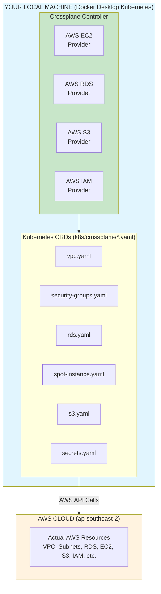

---

## CRD Dependency Graph

This diagram shows how Crossplane CRDs reference each other using **label selectors**.

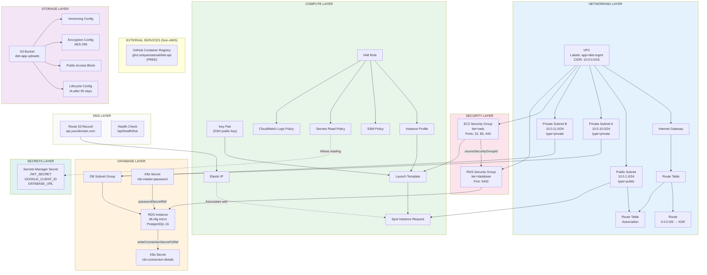

---

## Resource Creation Order

Crossplane automatically determines the correct creation order based on dependencies:

```mermaid
flowchart LR
    subgraph phase1["Phase 1: Foundation"]
        P1A["VPC"]
        P1B["IAM Role"]
        P1C["Key Pair"]
        P1D["S3 Bucket"]
    end

    subgraph phase2["Phase 2: Networking"]
        P2A["Internet Gateway"]
        P2B["Subnets"]
        P2C["Route Tables"]
        P2D["Security Groups"]
    end

    subgraph phase3["Phase 3: Database"]
        P3A["DB Subnet Group"]
        P3B["RDS Instance"]
    end

    subgraph phase4["Phase 4: Compute"]
        P4A["IAM Instance Profile"]
        P4B["Launch Template"]
        P4C["Spot Instance"]
        P4D["Elastic IP"]
    end

    subgraph phase5["Phase 5: DNS"]
        P5A["Route 53 Record"]
        P5B["Health Check"]
    end

    phase1 --> phase2 --> phase3 --> phase4 --> phase5

    style phase1 fill:#c8e6c9
    style phase2 fill:#bbdefb
    style phase3 fill:#ffe0b2
    style phase4 fill:#e1bee7
    style phase5 fill:#f5f5f5
```

---

## Application Architecture (What Runs Where)

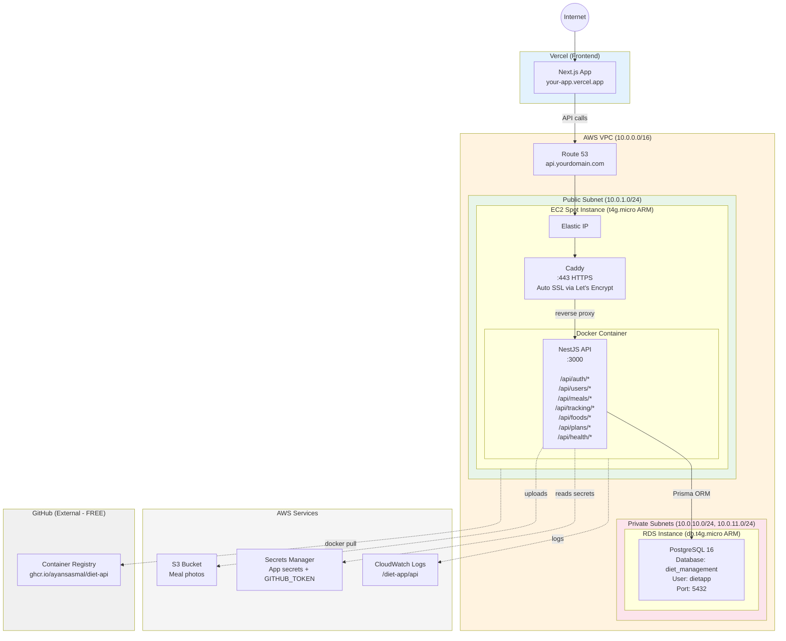

---

## Data Flow: Request/Response

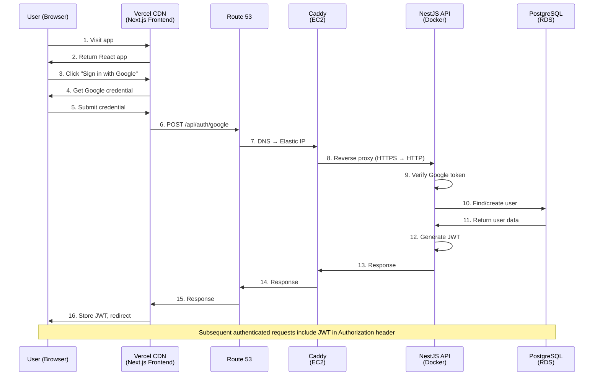

---

## Security Group Rules Flow

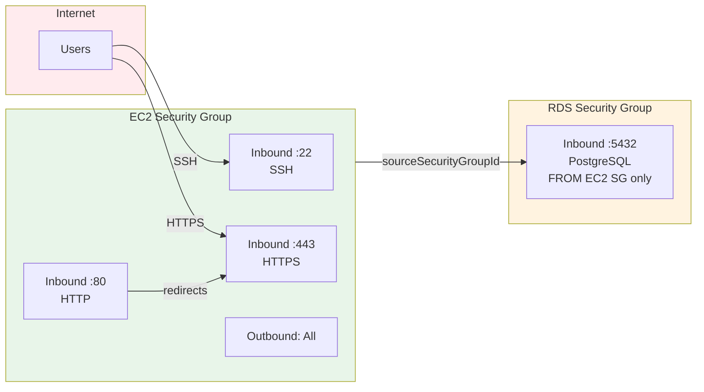

---

## Selector Reference Pattern

Crossplane uses **label selectors** to create references between resources:

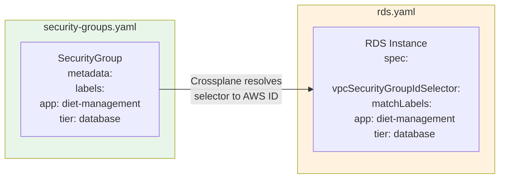

---

## Provider Config Switching (Local vs Production)

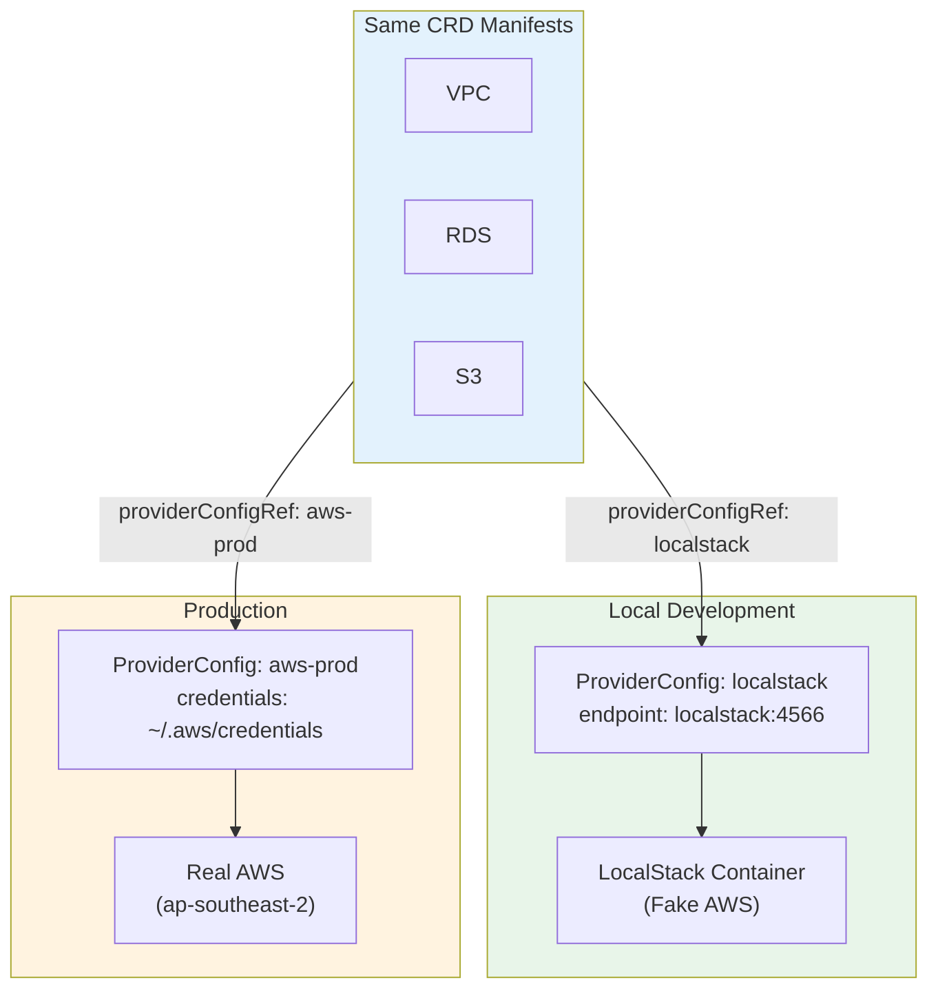

---

## CRD to AWS Resource Mapping

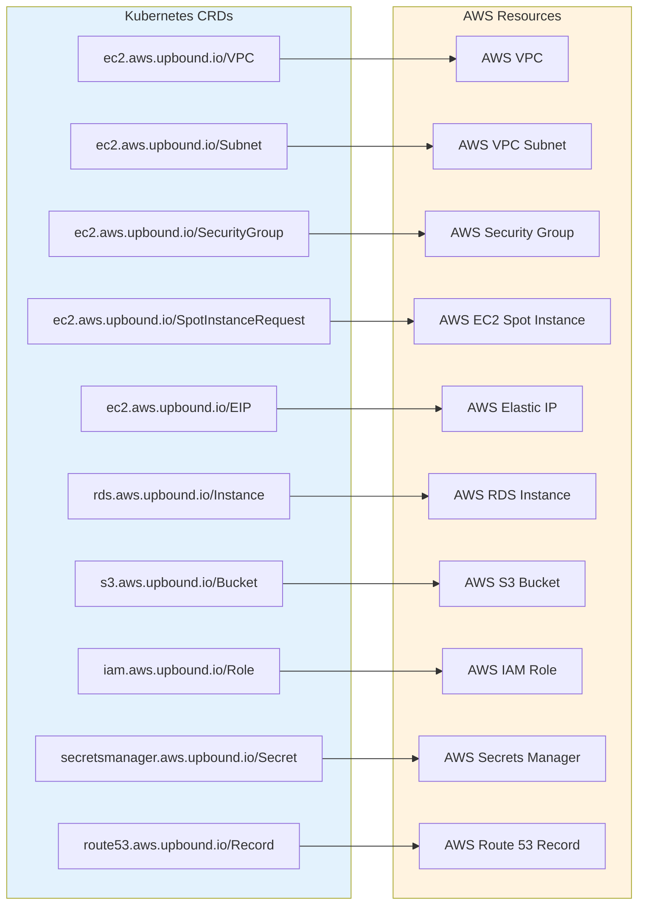

---

## Complete CRD to AWS Resource Mapping Table

| Crossplane CRD | AWS Resource | File |
|----------------|--------------|------|
| `ec2.aws.upbound.io/VPC` | VPC | `vpc.yaml` |
| `ec2.aws.upbound.io/Subnet` | VPC Subnet | `vpc.yaml` |
| `ec2.aws.upbound.io/InternetGateway` | Internet Gateway | `vpc.yaml` |
| `ec2.aws.upbound.io/RouteTable` | Route Table | `vpc.yaml` |
| `ec2.aws.upbound.io/Route` | Route | `vpc.yaml` |
| `ec2.aws.upbound.io/RouteTableAssociation` | Route Table Association | `vpc.yaml` |
| `ec2.aws.upbound.io/SecurityGroup` | Security Group | `security-groups.yaml` |
| `ec2.aws.upbound.io/SecurityGroupRule` | SG Ingress/Egress Rule | `security-groups.yaml` |
| `ec2.aws.upbound.io/KeyPair` | EC2 Key Pair | `spot-instance.yaml` |
| `ec2.aws.upbound.io/LaunchTemplate` | EC2 Launch Template | `spot-instance.yaml` |
| `ec2.aws.upbound.io/SpotInstanceRequest` | EC2 Spot Instance | `spot-instance.yaml` |
| `ec2.aws.upbound.io/EIP` | Elastic IP | `elastic-ip.yaml` |
| `iam.aws.upbound.io/Role` | IAM Role | `spot-instance.yaml` |
| `iam.aws.upbound.io/InstanceProfile` | IAM Instance Profile | `spot-instance.yaml` |
| `iam.aws.upbound.io/RolePolicyAttachment` | IAM Policy Attachment | `spot-instance.yaml` |
| `rds.aws.upbound.io/SubnetGroup` | RDS Subnet Group | `rds.yaml` |
| `rds.aws.upbound.io/Instance` | RDS DB Instance | `rds.yaml` |
| `s3.aws.upbound.io/Bucket` | S3 Bucket | `s3.yaml` |
| `s3.aws.upbound.io/BucketVersioning` | S3 Versioning Config | `s3.yaml` |
| `s3.aws.upbound.io/BucketServerSideEncryptionConfiguration` | S3 Encryption | `s3.yaml` |
| `s3.aws.upbound.io/BucketPublicAccessBlock` | S3 Public Access Block | `s3.yaml` |
| `s3.aws.upbound.io/BucketLifecycleConfiguration` | S3 Lifecycle Rules | `s3.yaml` |
| `secretsmanager.aws.upbound.io/Secret` | Secrets Manager Secret | `secrets.yaml` |
| `secretsmanager.aws.upbound.io/SecretVersion` | Secret Version | `secrets.yaml` |
| `route53.aws.upbound.io/Record` | Route 53 DNS Record | `route53.yaml` |
| `route53.aws.upbound.io/HealthCheck` | Route 53 Health Check | `route53.yaml` |
| `cloudwatchlogs.aws.upbound.io/Group` | CloudWatch Log Group | `cloudwatch.yaml` |
| `cloudwatchlogs.aws.upbound.io/MetricFilter` | CloudWatch Metric Filter | `cloudwatch.yaml` |
| `cloudwatch.aws.upbound.io/MetricAlarm` | CloudWatch Alarm | `cloudwatch.yaml` |
| `sns.aws.upbound.io/Topic` | SNS Topic | `cloudwatch.yaml` |

---

## Logging & Monitoring Architecture

Docker containers send logs to CloudWatch using the `awslogs` driver.

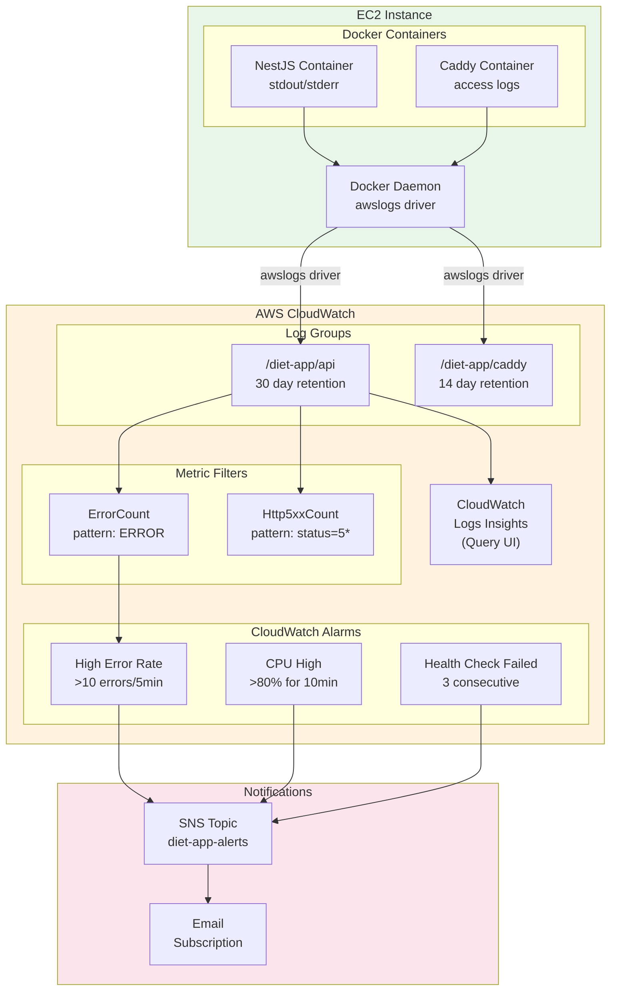

### Log Flow Detail

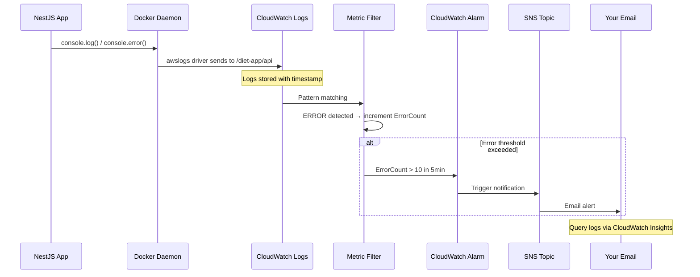

### CloudWatch Alarms Overview

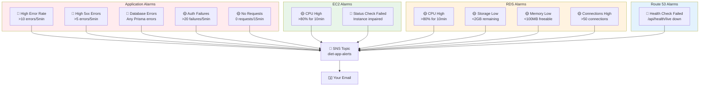

### Alarm Severity Levels

| Severity | Color | Action Required |
|----------|-------|-----------------|
| 🔴 Critical | Red | Immediate - App is down or degraded |
| 🟡 Warning | Yellow | Investigate soon - Potential issue |

### CloudWatch Logs Insights Queries

```sql
-- Find all errors in last hour
fields @timestamp, @message
| filter @message like /ERROR/
| sort @timestamp desc
| limit 100

-- HTTP 5xx errors with request details
fields @timestamp, @message
| filter @message like /status.*5\d{2}/
| parse @message '"method":"*","url":"*"' as method, url
| stats count() by method, url

-- Slow requests (>1000ms)
fields @timestamp, @message
| filter @message like /responseTime/
| parse @message 'responseTime":*,' as latency
| filter latency > 1000
| sort latency desc
```

### Costs

| Resource | Free Tier | After Free Tier |
|----------|-----------|-----------------|
| Log ingestion | 5GB/mo | $0.50/GB |
| Log storage | 5GB/mo | $0.03/GB/mo |
| Logs Insights queries | 5GB scanned/mo | $0.005/GB scanned |
| Alarms | 10 alarms | $0.10/alarm/mo |

**Estimated logging cost**: ~$1-3/mo for a personal app

---

## Key Concepts

### 1. Label Selectors
Resources reference each other using Kubernetes labels, not hardcoded IDs:
```yaml
vpcIdSelector:
  matchLabels:
    app: diet-management
```

### 2. Provider Config
All resources point to the same `providerConfigRef` which contains AWS credentials:
```yaml
providerConfigRef:
  name: aws-prod  # or 'localstack' for local dev
```

### 3. Cross-Resource References
Some resources write outputs that others can consume:
```yaml
# RDS writes connection details to a K8s secret
writeConnectionSecretToRef:
  name: rds-connection-details
  namespace: diet-app
```

### 4. Reconciliation Loop

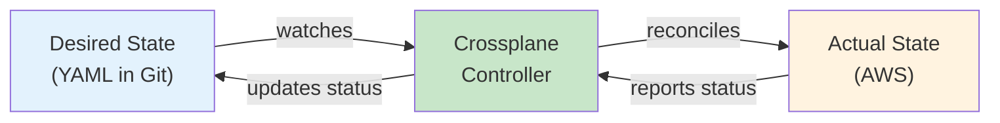

Crossplane continuously ensures actual AWS state matches desired YAML state:
- **Create** resources if missing
- **Update** resources if drifted
- **Delete** resources if YAML removed

---

*Last Updated: February 1, 2026*
